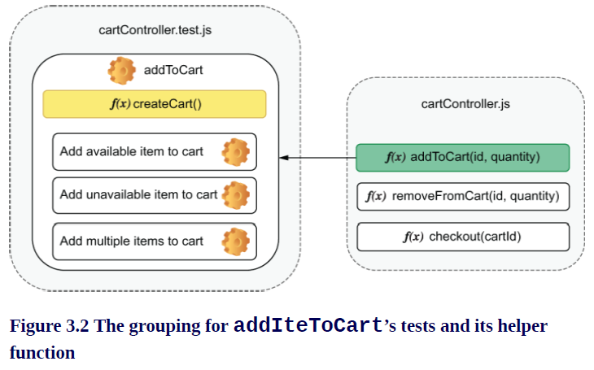
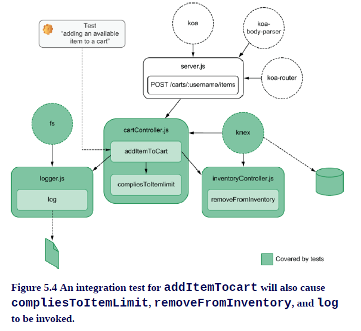
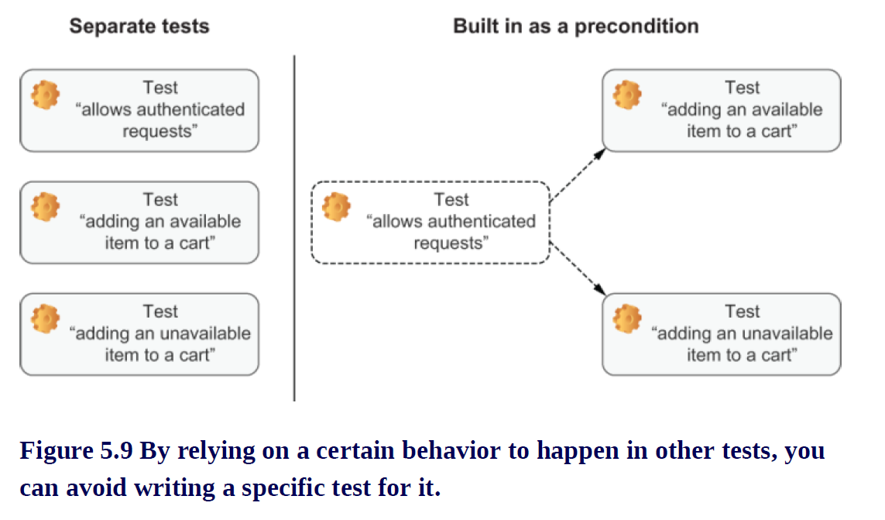

# Testing JavaScript Applications by Lucas da Costa

## Part 1. Testing JavaScript Applications

### 1. An introduction to automated testing
### 2. What do test and when?

## Part 2. Writing Tests

### 3. Testing techniques
### 4. Testing backend applications
### 5. Advanced backend testing techniques
### 6. Testing frontend applications
### 7. The React testing ecosystem
### 8. Testing React applications
### 9. Test-driven development
### 10. UI-based end-to-end testing
### 11. Writing UI-based end-to-end tests

## Part 3. Business Impact

### 12. Continuous integration and continous delivery
### 13. A culture of quality

---
---

# 1. An introduction to automated testing

## What is an automated test ?

Uncle Louis didn’t stand a chance in New York, but in London, he’s wellknown for his vanilla cheesecakes. Because of his outstanding popularity, it didn’t take long for him to notice that running a bakery on pen and paper doesn’t scale. To keep up with the booming orders, he decided to hire the best programmer he knows to build his online store: you.

His requirements are simple: customers must be able to order items from the bakery, enter the delivery address, and check out online. Once you implement these features, you decide to make sure the store works appropriately. You create the databases, seed them, spin up the server, and access the website on your machine to try ordering a few cakes. During this process, suppose you find a bug. You notice, for example, that you can have only one unit of an item in your cart at a time.

For Louis, it would be disastrous if the website went live with such a defect. Everyone knows that it’s impossible to eat a single macaroon at a time, and therefore, no macaroons—one of Louis’s specialties—would sell. To avoid that happening again, you decide that adding multiple units of an item is a use case that always needs to be tested.

You could decide to manually inspect every release, like old assembly lines used to do. But that’s an unscalable approach. It takes too long, and, as in any manual process, it’s also easy to make mistakes. To solve this problem, you must replace yourself, the customer, with code.

Let’s think about how a user tells your program to add something to the cart. This exercise is useful to identify which parts of the action flow need to be replaced by automated tests.

Users interact with your application through a website, which sends an HTTP request to the backend. This request informs the addToCart function which item and how many units they want to add to their cart. The customer’s cart is identified by looking at the sender’s session. Once the items were added to the cart, the website updates according to the server’s response. This process is shown in figure 1.1.


Let’s replace the customer with a piece of software that can call the addToCartFunction. Now, you don’t depend on someone to manually add items to a cart and look at the response. Instead, you have a piece of code that does the verification for you. That’s an automated test.

> ***AUTOMATED TEST:*** Automated tests are programs that automate the task of testing your software. They interface with your application to perform actions and compare the actual result with the expected output you have previously defined.

Your testing code creates a cart and tells addToCart to add items to it. Once it gets a response, it checks whether the requested items are there, as shown in figure 1.2.


Within your test, you can simulate the exact scenario in which users would be able to add only a single macaroon to their cart:

1. Create an instance of a cart.

2. Call addToCart and tell it to add a macaroon to that cart.

3. Check whether the cart contains two macaroons.

By making your test reproduce the steps that would cause the bug to happen, you can prove that this specific bug doesn’t happen anymore.

The next test we will write is to guarantee that it’s possible to add multiple macaroons to the cart. This test creates its own instance of a cart and uses the addToCart function to try adding two macaroons to it. After calling the addToCart function, your test checks the contents of the cart. If the cart’s contents match your expectations, it tells you that everything worked properly. We’re now sure it’s possible to add two macaroons to the cart, as shown in figure 1.3.


Now that customers can have as many macaroons as they want—as it should be—let’s say you try to simulate a purchase your customer would make: 10,000 macaroons. Surprisingly, the order goes through, but Uncle Louis doesn’t have that many macaroons in stock. As his bakery is still a small business, he also can’t fulfill humongous orders like this on such short notice. To make sure that Louis can deliver flawless desserts to everyone on time, he asks you to make sure that customers can order only what’s in stock.

To identify which parts of the action flow need to be replaced by automated tests, let’s define what should happen when customers add items to their carts and adapt our application correspondingly.

When customers click the “Add to Cart” button on the website, as shown in figure 1.4, the client should send an HTTP request to the server telling it to add 10,000 macaroons to the cart. Before adding them to the cart, the server must consult a database to check if there are enough in stock. If the amount in stock is smaller or equal to the quantity requested, the macaroons will be added to the cart, and the server will send a response to the client, which updates accordingly.

> *NOTE* You should use a separate testing database for your tests. Do not pollute your production database with testing data. Tests will add and manipulate all kinds of data, which can lead to data being lost or to the database being in an inconsistent state. Using a separate database also makes it easier to determine a bug’s root cause. Because you are fully in control of the test database’s state, customers’ actions won’t interfere with your tests’ results.


This bug is even more critical, so you need to be twice as careful. To be more confident about your test, you can write it before actually fixing the bug, so that you can see if it fails as it should.

***The only useful kind of test is a test that will fail when your application doesn’t work.***

This test is just like the one from earlier: it replaces the user with a piece of software and simulates its actions. The difference is that, in this case, you need to add one extra step to remove all macaroons from the inventory. The test must set up the scenario and simulate the actions that would cause the bug to happen; see figure 1.5.

Once the test is in place, it’s also much quicker to fix the bug. Every time you make a change, your test will tell you whether the bug is gone. You don’t need to manually log in to the database, remove all macaroons, open the website, and try to add them to your cart. The test can do it for you much quicker.

Because you have also written a test to check whether customers can add multiple items to the cart, if your fix causes the other bug to reappear, that test will warn you. Tests provide quick feedback and make you more confident that your software works.


I must warn you, however, that automated tests are not the panacea for producing software that works. Tests can’t prove your software works; they can only prove it doesn’t. If adding 10,001 macaroons to the cart still caused their availability to be ignored, you wouldn’t know unless you tested this specific input.

Tests are like experiments. You encode our expectations about how the software works into your tests, and because they passed in the past, you choose to believe your application will behave the same way in the future, even though that’s not always true. The more tests you have, and the closer these tests resemble what real users do, the more guarantees they give you.

Automated tests also don’t eliminate the need for manual testing. Verifying your work as end users would do and investing time into exploratory testing are still indispensable. Because this book is targeted at software developers instead of QA analysts, in the context of this chapter, I’ll refer to the unnecessary manual testing process often done during development just as manual testing.

## Why automated tests matter

Tests matter because they give you quick and fail-proof feedback. In this chapter, we’ll look in detail at how swift and precise feedback improves the software development process by making the development workflow more uniform and predictable, making it easy to reproduce issues and document tests cases, easing the collaboration among different developers or teams, and shortening the time it takes to deliver high-quality software.

## Predictability

Having a predictable development process means preventing the introduction of unexpected behavior during the implementation of a feature or the fixing of a bug. Reducing the number of surprises during development also makes tasks easier to estimate and causes developers to revisit their work less often.

Manually ensuring that your entire software works as you expect is a timeconsuming and error-prone process. Tests improve this process because they decrease the time it takes to get feedback on the code you write and, therefore, make it quicker to fix mistakes. The smaller the distance between the act of writing code and receiving feedback, the more predictable development becomes.

To illustrate how tests can make development more predictable, let’s imagine that Louis has asked you for a new feature. He wants customers to be able to track the status of their orders. This feature would help him spend more time baking and less time answering the phone to reassure customers that their order will be on time. Louis is passionate about cheesecakes, not phone calls.

If you were to implement the tracking feature without automated tests, you’d have to run through the entire shopping process manually to see if it works, as shown in figure 1.6. Every time you need to test it again, besides restarting the server, you also need to clear your databases to make sure they are in a consistent state, open your browser, add items to the cart, schedule a delivery, go through checkout, and only then you’d finally test tracking your order.


Before you can even manually test this feature, it needs to be accessible on the website. You need to write its interface and a good chunk of the backend the client talks to.

Not having automated tests will cause you to write too much code before checking whether the feature works. If you have to go through a long and tedious process every time you make changes, you will write bigger chunks of code at a time. Because it takes so long to get feedback when you write bigger chunks of code, by the time you do receive it, it might be too late. You have written too much code before testing, and now there are more places for bugs to hide. Where, among the thousand new lines of code, is the bug you’ve just seen?


With an automated test like the ones in figure 1.7, you can write less code before getting feedback. When your automated tests can call the trackOrder function directly, you can avoid touching unnecessary parts of your application before you’re sure that trackOrder works.

When a test fails after you’ve written only 10 lines of code, you have only 10 lines of code to worry about. Even if the bug is not within those 10 lines, it becomes way easier to detect which one of them provoked misbehavior somewhere else.

The situation can get even worse if you break other parts of your application. If you introduce bugs into the checkout procedure, you need to check how your changes affected it. The more changes you’ve made, the harder it becomes to find where the problem is.

When you have automated tests like the ones in figure 1.8, they can alert you as soon as something breaks so that you can correct course more easily. If you run tests frequently, you will get precise feedback on what part of your application is broken as soon as you break it. ***Remember that the less time it takes to get feedback once you’ve written code, the more predictable your development process will be.***


Often I see developers having to throw work away because they’ve done too many changes at once. When those changes caused so many parts of the application to break, they didn’t know where to start. It was easier to start from scratch than to fix the mess they had already created. How many times have you done that?

## Reproducibility

The more steps a particular task has, the more likely a human is to make mistakes following them. Automated tests make it easier and quicker to reproduce bugs and ensure they aren’t present anymore.

For a customer to track the status of an order, they will have to go through multiple steps. They’d have to add items to their cart, pick a delivery date, and go through the checkout process. To test your application and ensure that it will work for customers, you must do the same. This process is reasonably long and error-prone, and you could approach each step in many different ways. With automated tests, we can ensure that these steps are followed to the letter.

Let’s assume that you find bugs when you test your application, like being able to check out with an empty cart or with an invalid credit card. For you to find those bugs, you had to go through a series of steps manually.

To avoid those bugs happening again, you must reproduce the exact same steps that cause each one of them. If the list of test cases grows too long or if there are too many steps, the room for human mistakes gets bigger. Unless you have a checklist that you follow to the letter every single time, bugs will slip in (see figure 1.9).

Ordering a cake is something you will certainly remember to check, but what about ordering –1 cakes, or even NaN cakes? People forget and make mistakes, and, therefore, software breaks. Humans should do things that humans are good at, and performing repetitive tasks is not one of them.


Even if you decide to maintain a checklist for those test cases, you will have the overhead of keeping that documentation always up-to-date. If you ever forget to update it and something not described in a test case happens, who’s wrong—the application or the documentation?

Automated tests do the exact same actions every time you execute them. When a machine is running tests, it neither forgets any steps nor makes mistakes.

## Collaboration

Everyone who tastes Louis’s banoffee pies knows he’s one Great British Bake Off away from stardom. If you do everything right on the software side, maybe one day he’ll open bakeries everywhere from San Franciso to Saint Petersburg. In that scenario, a single developer just won’t cut it.

If you hire other developers to work with you, all of a sudden, you start having new and different concerns. If you’re implementing a new discount system, and Alice is implementing a way to generate coupons, what do you do if your changes to the checkout procedure make it impossible for customers also to apply coupons to their orders? In other words, how can you ensure that your work is not going to interfere with hers and vice versa?

If Alice merges her feature into the codebase first, you have to ask her how you’re supposed to test her work to ensure yours didn’t break it. Merging your work will consume your time and Alice’s.

The effort you and Alice spent manually testing your changes will have to be repeated when integrating your work with hers. On top of that, there will be additional effort to test the integration between both changes, as illustrated by figure 1.10.


Besides time-consuming, this process is also error-prone. You have to remember all the steps and edge cases to test in both your work and Alice’s. And, even if you do remember, you still need to follow them exactly.

When a programmer adds automated tests for their features, everyone else benefits. If Alice’s work has tests, you don’t need to ask her how to test her changes. When the time comes for you to merge both pieces of work, you can simply run the existing automated tests instead of going through the whole manual testing process again.

Even if your changes build on top of hers, tests will serve as up-to-date documentation to guide further work. Well-written tests are the best documentation a developer can have. Because they need to pass, they will always be up-to-date. If you are going to write technical documentation anyway, why not write a test instead?

If your code integrates with Alice’s, you will also add more automated tests that cover the integration between your work and hers. These new tests will be used by the next developers when implementing correlated features and, therefore, save them time. Writing tests whenever you make changes creates a virtuous collaboration cycle where one developer helps those who will touch that part of the codebase next (see figure 1.11).

This approach reduces communication overhead but does not eliminate the need for communication, which is the foundation stone for every project to succeed. Automated tests remarkably improve the collaboration process, but they become even more effective when paired with other practices, such as code reviews.


One of the most challenging tasks in software engineering is to make multiple developers collaborate efficiently, and tests are one of the most useful tools for that.

## Speed

Louis doesn’t care about which language you use and much less about how many tests you have written. Louis wants to sell pastries, cakes, and whatever other sugary marvels he can produce. Louis cares about revenue. If more features make customers happier and generate more revenue, then he wants you to deliver those features as fast as possible. There’s only one caveat: they must work.

For the business, it’s speed and correctness that matters, not tests. In all the previous sections, we talked about how tests improved the development process by making it more predictable, reproducible, and collaborative, but, ultimately, those are benefits only because they help us produce better software in less time.

When it takes less time for you to produce code, prove that it doesn’t have specific bugs, and integrate it with everyone else’s work, the business succeeds. When you prevent regressions, the business succeeds. When you make deployments safer, the business succeeds.

Because it takes time to write tests, they do have a cost. But we insist on writing tests because the benefits vastly outweigh the drawbacks.

Initially, writing a test can be time-consuming, too, even more than doing a manual test, but the more you run it, the more value you extract from it. If it takes you one minute to do a manual test and you spend five minutes writing one that’s automated, as soon as it runs for the fifth time it will have paid for itself—and trust me, that test is going to run way more than five times.

In contrast to manual testing, which will always take the same amount of time or more, automating a test causes the time and effort it takes to run it to drop to almost zero. As time passes, the total effort involved in manual tests grows much quicker. This difference in effort between writing automated tests and performing manual testing is illustrated in figure 1.12.


Writing tests is like buying stocks. You may pay a big price up-front, but you will continue to reap the dividends for a long time. As in finance, the kind of investment you will make—and whether you will make it—depends on when you need the money back. Long-term projects are the ones that benefit the most from tests. The longer the project runs, the more effort is saved, and the more you can invest in new features or other meaningful activities. Short-term projects, like the ones you make in pizza-fueled hackathons, for example, don’t benefit much. They don’t live long enough to justify the effort you will save with testing over time.

The last time Louis asked you if you could deliver features faster if you were not writing so many tests, you didn’t use the financial analogy, though. You told him that this would be like increasing an oven’s temperature for a cake to be ready sooner. The edges get burned, but the middle is still raw.

## Summary

* Automated tests are programs that automate the task of testing your software. These tests will interact with your application and compare its actual output to the expected output. They will pass when the output is correct and provide you with meaningful feedback when it isn’t.

* Tests that never fail are useless. The goal of having tests is for them to fail when the application misbehaves no longer present.

* You can’t prove your software works. You can prove only it doesn’t. Tests show that particular bugs are no longer present—not that there are no bugs. An almost infinite number of possible inputs could be given to your application, and it’s not feasible to test all of them. Tests tend to cover bugs you’ve seen before or particular kinds of situations you want to ensure will work.

* Automated tests reduce the distance between the act of writing code and getting feedback. Therefore, they make your development process more structured and reduce the number of surprises. A predictable development process makes it easier to estimate tasks and allows developers to revisit their work less often.

* Automated tests always follow the exact same series of steps. They don’t forget or make mistakes. They ensure that test cases are followed thoroughly and make it easier to reproduce bugs.

* When tests are automated, rework and communication overhead decrease. On their own, developers can immediately verify other people’s work and ensure they haven’t broken other parts of the application.

* Well-written tests are the best documentation a developer can have. Because tests need to pass, they must always be up-to-date. They demonstrate the usage of an API and help others understand how the codebase works.

* Businesses don’t care about your tests. Businesses care about making a profit. Ultimately, automated tests are helpful because they drive up profits by helping developers deliver higher-quality software faster.

* When writing tests, you pay a big price up-front by investing extra time in creating them. However, you get value back in dividends. The more often a test runs, the more time it has saved you. Therefore, the longer the life cycle of a project, the more critical tests become

# 2. What do test and when?

## Introduction

It’s essential to understand how tests fit into different categories because different types of tests serve different purposes. When building a car, for example, it’s crucial to test the engine and the ignition system individually, but it’s also vital to ensure they work together. If not, both the engine and the ignition system are useless. It’s equally as important to test whether people can drive the car once all parts are in place, or else nobody will go anywhere.

When we build software, we want to have similar guarantees. We want to ensure our functions work in isolation as well as in integration. And, when we put all of these functions together in an application, we want to ensure customers can use it.

These different types of tests serve different purposes, run at different frequencies, and take different amounts of time to complete. Some are more suited to guide you through the development phase, whereas others can make it easier to test a feature only after it’s complete. Some tests interface directly with your code, and others interact with your application through a graphical interface, as an end user would do. It’s your job to decide which of these tests to use and when.

Learning about these different labels is helpful because they help you decide what your tests should and should not cover in each situation. In reality, these definitions are a bit blurry. You will rarely find yourself proactively labeling different types of tests, but knowing that labels exist and having good examples for each of them is invaluable for creating strong quality guarantees and for unambiguous communication with colleagues.

## The testing pyramid

Louis’s bakery is committed to producing the highest quality pastries East London has ever tasted. Louis and his team meticulously inspect every ingredient to guarantee it’s fresh and new. The same happens to all the parts of his cheesecakes. From the crust to the batter, each step in the recipe goes through rigorous quality control to scrutinize its texture and consistency. For every cheesecake made, Louis makes sure also to bake a “proof”: a small separate piece for him to savor—a sweet reward and the ultimate proof that Louis’s cheesecakes are undeniably delectable.

When you keep your desserts up to such high standards, you don’t want your software to fall behind. For that, there’s a lot we can learn from the way Louis ensures his baked goods are the best in town.

In the same way that low-quality ingredients ruin a cake, poorly written functions ruin a piece of software. If your functions don’t work, then your whole application won’t. Testing these tiny pieces of software is the first step in achieving high-quality digital products.

The next step is to ensure that all the intermediary products of this process are as high quality as its parts. When combining those functions into larger components, like when combining ingredients to make dough, you must ensure that the blend is as good as its individual items.

Finally, just as Louis tastes his cakes as his customers would, we must also try our software as our users would. If all of its modules work, but the application itself doesn’t, it’s a useless product.

* Test individual ingredients.
* Test the combination of the primary ingredients into intermediary products.
* Test the final product.

Mike Cohn’s testing pyramid (figure 2.1)—the metaphor whose name designates this section—comes from this idea that different parts of your software must be tested in diverse ways and with varying regularity.

It divides tests into the following three categories:

* UI tests
* Service tests
* Unit tests


The higher the tests are in the pyramid, the less frequently they run and the more value they provide. Tests in the top are few, and tests in the bottom are numerous.

Unit tests attest to the quality of the most atomic unit in your software: your functions. Service tests ensure these functions work in integration as a service. UI tests verify your work from a user’s perspective by interacting with your software through the user interface it provides.

The size of the pyramid’s layers indicates how many tests of that kind we should write. Their placement in the pyramid suggests how strong the guarantees those tests provide are. The higher up a test fits into the pyramid, the more valuable it is.

Back to our baking analogy: unit tests are analogous to inspecting individual ingredients. It’s a reasonably quick and cheap task that can be done multiple times quite early in the overall process, but it provides little value when compared to further quality control steps. Unit tests fit into the bottom part of the pyramid because we have many of them, but their quality assurance guarantees aren’t as strict as the other tests’.

Service tests are analogous to inspecting the intermediary products of the recipe. In comparison to the inspection of individual ingredients, these tests are reasonably more complex and can be done only in the later phases of the overall process. Nonetheless, they provide more compelling evidence that a heavenly cheesecake is about to materialize. They fit into the middle of the pyramid because you should have fewer service tests than unit tests and because they provide stronger quality guarantees.

UI tests are analogous to tasting your cheesecake once it’s done. They tell you whether the final product matches your expectations. To perform these tests, you must have gone through the entire recipe and have a finished product. They go into the top of the pyramid because these test should be the most sporadic and are the ones that provide the most stringent guarantees.

Each one of the pyramid’s testing layers builds on top of the one underneath. All of them help us assert the quality of the final product, but at different stages of the process. Without fresh ingredients, for example, you can’t have a luxurious batter. Furthermore, without a luxurious batter, you can’t have a sublime cheesecake.

> ***WARNING*** This terminology is not used consistently throughout the industry. You may see people referring to these same categories with different names. The separation between these categories is blurry, just as it is to differentiate one kind of test from another when we see the source code.

Mike’s pyramid is, in general, an excellent mental framework. Separating tests into different categories is instrumental in determining how many of each type we should write and how often they should run. But I find it problematic to divide tests by their target, be it a function, service, or interface.

If, for example, you are writing tests that target a web application, should all of its tests be considered UI tests? Even though you are testing the client itself, you may have separate tests for individual functions and other tests that actually interact with the GUI. If your product is a RESTful API and you test it by sending it HTTP requests, is this a service test or a UI test? Even though you are testing a service, the HTTP API is the interface provided to your users.

Instead of dividing tests by their targets, I suggest that we separate tests by how broad their scope is. The larger the portion of your software a test makes up, the higher it will be placed in the pyramid.

This revised pyramid (shown in figure 2.2) divides tests into three categories, too, but labels them differently and used the level of isolation of each test as the main criterion for its division. The new labels are as follows:

* End-to-end tests
* Integration tests
* Unit tests


Unit tests are the same as in Mike’s original pyramid. They validate the most atomic building blocks of your software: its functions. The tests that directly interact with individual functions in chapter 1 fit into this category. The scope of these tests is the smallest possible, and they assert only the quality of individual functions.

Integration tests validate how the different pieces of your software work together. Tests that call a function and check whether it has updated items in a database are in this category. An example of an integration test is the test in chapter 1 that ensures that only available items can be added to the cart. The scope of these tests is broader than the scope of unit tests but smaller than the scope of end-to-end tests. They assert the quality of the intermediary steps of the process.

End-to-end tests validate your application from a user’s perspective, treating your software as much as a black box as possible. A test that controls a web browser and interacts with your application by clicking buttons and verifying labels is in this category. End-to-end tests correspond to tasting a sample of your cheesecake. Their scope is the entire application and its features.

As in the real world, tests don’t necessarily need to be in one category or the other. Many times they will fit between groups, and that’s fine. These categories don’t exist for us to write labels on top of each of our tests. They exist to guide us toward better and more reliable software, indicating which tests we should write, when, and how much. For a detailed comparison between the different aspects of each type of test, see table 2.1.


Using this new taxonomy, let’s think about how we’d classify specific examples of tests and where they’d fit in our revised test pyramid.

If your end product is a RESTful API, tests that send requests to it are one kind of end-to-end test. If you build a web application that talks to this API, then tests that open a web browser and interact with it from a user’s perspective are also end-to-end tests, but they should be placed even higher in the pyramid.

Tests for your React components fit somewhere between the integration and unit layers. You may be testing UI, but you are orienting your development process by interacting with individual parts of your application in integration with React’s API.

> ***NOTE*** Remember not to be too concerned about fitting tests into one category or another. The pyramid exists as a mental framework for you to think about the different types of guarantees you want to create around your software. Because every piece software is different, some pyramids may have a narrower base or a wider top than others, but, as a general rule, you should strive to keep the pyramid’s shape.

## Unit tests

In the same way that you can’t bake tasty desserts without fresh ingredients, you can’t write great software without well-written functions. Unit tests help you ensure that the smallest units of your software, your functions, behave as you expect them to. In this section, you’ll write your first automated test: a unit test.

To visualize precisely what these tests cover, assume that the bakery’s online store, whose components are shown in figure 2.3, consists of a React client and a Node.js backend that talks to a database and an email service.


The tests you will write cover a small portion of this application. They will deal only with individual functions within your server.

Unit tests are at the bottom of the pyramid, so their scope, shown in figure 2.4, is small. As we move up, you will see that the surface covered by tests will increase.


Start by writing the function shown in listing 2.1 that will be the target of your test. Create a file called Cart.js, and write a class Cart that has an addToCart function.

> ***UNIT UNDER TEST:*** Most of the literature related to testing refers to the target of your tests as the unit under test.

```JavaScript
export default class Cart {
    constructor() {
        this.items = [];
    }

    addToCart(item) {
        this.items.push(item);
    }
}
```

Now think about how you’d go about testing the addToCart function. One of the ways would be to integrate it into a real application and use it, but then we’d run into problems involving time, repeatability, and costs, as we mentioned in chapter 1.

Having to write an entire application before you can test your code requires too much code to be written before knowing whether it works. Additionally, if it doesn’t work, it will be challenging to spot bugs. A quicker way would be to write code that imports your Cart, uses its addToCart function, and validates the result.

Go on and write a Cart.test.js file that imports your Cart, uses its addToCart function, and checks whether a cart has the items you expected, as shown in listing 2.2.

```JavaScript
import Cart from './Listing_2_1';

const cart = new Cart();
cart.addToCart("cheesecake");


const hasOneItem = cart.items.length === 1;
const hasACheesecake = cart.items[0] === 'cheesecake';

// If both cheks have succeeded, prints a success message to the console
if (hasOneItem && hasACheesecake) {
    console.log("The addToCart function can add an item to the cart");
} else {
    // If any of the tests failed, prints error messages

    // Creates a comma-separated list of the actual items in the cart to display in the test's error message
    const actualContent = cart.items.join(", ");

    console.error("The addToCart function didn't do what we expect!");
    console.error(`Here is the actual content of the cart: ${actualContent}`);

    throw new Error("Test failed!");
}
```

When you execute this file using node Cart.test.js, it will tell you whether your code can successfully add cheesecake to the cart—instant and precise feedback.

Congratulations! You have just written your first test. A test sets up a scenario, executes the target code, and verifies whether the output matches what you expected. Because tests tend to follow this same formula, you can use tools to abstract away the testing specific concerns of your code. One of these concerns, for example, is comparing whether the actual output matches the expected output.

Node.js itself ships with a built-in module, called assert, to do those checks, which, in the context of tests, we call assertions. It contains functions to compare objects and throw errors with meaningful messages if the actual output doesn’t match what you expected.

Use assert’s deepStrictEqual function to compare the actual output with the expected output and therefore shorten your test, as shown next.

```JavaScript
import assert from 'assert';
import Cart from './Listing_2_1';

const cart = new Cart();
cart.addToCart("cheesecake");

// Compares the first and second arguments, and throws an insightful error if their values are different
assert.deepStrictEqual(cart.items, ["cheesecake"]);

console.log("The addToCart function can add an item to the cart");
```

Using an assertion library enables you to get rid of the convoluted logic to determine whether objects are equal. It also generates meaningful output, so you don’t have to manipulate strings yourself.

Now suppose you implement a removeFromCart function, as shown here.

```JavaScript
export default class Cart {
    constructor() {
        this.items = [];
    }

    addToCart(item) {
        this.items.push(item);
    }

    removeFromCart(item) {
        for (let i = 0 ; i < this.items.length ; i++) {
            const currentItem = this.items[i];
            if (currentItem === item) {
                this.items.splice(i, 1);
            }
        }
    }
}
```

How would you test it? Probably, you’d write something like the following code.

```JavaScript
import assert from 'assert';
import Cart from './Listing_2_4.js';

const cart = new Cart();

// Adds an item to the cart
cart.addToCart("cheesecake");
// Removes the recently added item
cart.removeFromCart("cheesecake");

// Checks wheter the cart's items property is an empty array
assert.deepStrictEqual(cart.items, []);

console.log("The removeFromCart function can remove an item from the cart");
```

First, your test sets up a scenario by adding a cheesecake to the cart. Then it calls the function you want to test (in this case, removeFromCart). Finally, it checks whether the content of the cart matches what you expected it to be. Again, the same formula: setup, execution, and verification. This sequence is also known as the three As pattern: arrange, act, assert.

Now that you have multiple tests, think about how you’d add them to your Cart.test.js. If you paste your new test right after the old one, it won’t run if the first test fails. You will also have to be careful to give variables in both tests different names. But, most importantly, it would become harder to read and interpret the output of each test. To be honest, it would be a bit of a mess.

Test runners can solve this problem. They enable you to organize and run multiple tests in a comprehensive manner, providing meaningful and easily readable results.

At the present moment, the most popular testing tool in the JavaScript ecosystem is called Jest.

Jest is a testing framework created at Facebook. It focuses on simplicity and, therefore, ships with everything you need to start writing tests straightaway.

Let’s install Jest so that we can write unit tests more concisely. Go ahead and install it globally with the command npm install -g jest.

Without a configuration file, jest.config.js, or a package.json file, Jest will not run, so remember to add a package.json file to the folder that contains your code.

Now, instead of manually running your test file with Node.js, you will use Jest and tell it to load and execute tests.

> *NOTE:* By default, Jest loads all files ending in .test.js, .spec.js, or tests inside folders named tests.

Prepare your tests for Jest to run by wrapping them into the test function that Jest adds to the global scope. You can use this function to organize multiple tests within a single file and indicate what should run. It takes the test’s name as its first argument and a callback function containing the actual test as the second argument.

Once you have wrapped the previous tests into Jest’s test function, your Cart.test.js file should look like this.

```JavaScript
import * as jest from 'jest';
import assert from 'assert';
import Cart from './Listing_2_4.js';


// Encapsulates the first test into a different namespace, isolating its varialbes and prodcuing more readable output
test("The addToCart function can add an item to the cart", () => {
    // Arrange: create an empty cart
    const cart = new Cart();

    // Act: exercises the addToCart function
    cart.addToCart("cheesecake");

    // Assert: checks whether cart contains the newly added item
    assert.deepStrictEqual(cart.items, ["cheesecake"]);
});


// Encapsulates the second test into a different namespace
test("The removeFromCart function can remove an item from the cart", () => {
    // Arrange: creates an empty cart, and adds an item to it
    const cart = new Cart();
    cart.addToCart("cheesecake");

    // Act: exercises the removeFromCart function
    cart.removeFromCart("cheesecake");

    // Assert: checks whether the cart is empty
    assert.deepStrictEqual(cart.items, []);
})
```

Notice how you eliminated the previous if statements used to determine how to generate output by delegating that task to Jest. Whenever a test fails, Jest will provide you with a precise diff so that you can see how the actual output was different from what you expected. To see how much better Jest’s feedback is, try changing one of the assertions so that it fails.

Finally, to avoid using anything but Jest for your tests, replace the assert library with Jest’s own alternative: expect. The expect module is just like Node.js’s assert module, but it’s tailored for Jest and helps it provide feedback that’s even more helpful.

Like the test function, expect is available in the global scope when running tests within Jest. The expect function takes as an argument the actual subject of the assertion and returns an object that provides different matcher functions. These functions verify whether the actual value matches your expectations.

Jest’s equivalent to deepStrictEqual is toEqual. Replacing your first test’s deepStrictEqual with toEqual should lead you to code that looks similar to the following listing.

```JavaScript
import * as jest from 'jest';
import assert from 'assert';
import Cart from './Listing_2_4.js';

test("The addToCart function cna add an item to the cart", () => { 
    const cart = new Cart();
    cart.addToCart("cheesecake");

    // Compares the value of the assertion's target - the argument provided to expect - to the value of the argument passed to toEqual
    expect(cart.items).toEqual(["cheesecake"]);
});
```

> ***IMPORTANT:*** There’s a difference between “strict” equality checks and “deep” equality checks. Deep equality verifies whether two different objects have equal values. Strict equality verifies whether two references point to the same object. In Jest, you perform deep equality checks using toEqual, and strict equality checks using toBe. Read Jest’s documentation for the toEqual matcher to learn more about how it works. It’s available at https://jestjs.io/docs/en/expect#toequalvalue.

Up to now, you have been using a global installation of Jest to run your tests, which is not a good idea. If you are using an assertion that is available only in the latest version of Jest and one of your coworkers’ global installation is older than yours, tests may fail if the assertion’s behavior changed from one version to another.

You want tests to fail only when there’s something wrong with your application, not when people are running different versions of a test framework.

Solve this problem by running npm install jest --savedev to install Jest as a devDependency. It should be a devDependency because it doesn’t need to be available when you ship your application. It needs to be available in developers’ machines only so that they can execute tests after they download the project and run npm install.

Once you run that command, you will see that your package.json file now lists a specific version of Jest within its devDependencies.

> *NOTE:* Did you notice that the version of Jest within your package.json has ^ in front of it? That ^ indicates that when running npm install, NPM will install the latest major version of Jest. In other words, the leftmost version number will not change. In theory, when following semantic versioning practices, any nonmajor upgrades should be backward-compatible, but, in reality, they are not always. To force NPM to install an exact version of Jest when running npm install, remove the ^. I highly recommend readers read more about what semantic versioning is and how it works. The website https://semver.org is an excellent resource for that.

Your project’s dependencies, including Jest, are available within the node_modules folder. You can run the specific version of Jest specified in your package.json by running its built version located in node_modules/.bin/jest. Go ahead and execute that file. You will see that it produces the same output as before.

It’s still cumbersome to type the full path to your project’s Jest installation every time we want to run tests, though. To avoid that, edit your package.json file, and create a test script that executes the project’s Jest installation whenever you run the npm test command.

Add a test property under scripts in your package.json, and specify that it should run the jest command, as shown next.

```json
{
    "name": "5_global_jest",
    "version": "1.0.0",
    "scripts": {
        "test": "jest"
    },
    "devDependencies": {
        "jest": "^26.6.0"
    }
}
```

After creating this NPM script, whenever someone wants to execute your project’s tests, they can run npm test. They don’t need to know which tool you are using or worry about any other options they may need to pass to it. Whatever the command within the package.jsontest script is, it will run.

> *NOTE:* When you run a command defined in your package.json scripts, it spawns a new shell environment, which has ./node_modules/.bin added to its PATH environment variable. Because of this PATH, you don’t need to prefix commands with ./node_modules/.bin. By default, any installed libraries you have will be preferred.

When refactoring, you want to ensure that you can shape your code differently while maintaining the same functionality. Therefore, having rigorous unit tests is a fantastic way to obtain quick and precise feedback during the process.

Unit tests help you iterate confidently, by providing quick feedback as you write code, as we will see in detail when we talk about test-driven development in chapter 9. Because unit tests’ scope is limited to a function, their feedback is narrow and precise. They can immediately tell which function is failing. Strict feedback like this makes it faster to write and fix your code.

These tests are inexpensive and quick to write, but they cover only a small part of your application, and the guarantees they provide are weaker. Just because functions work in isolation for a few cases doesn’t mean your whole software application works, too. To get the most out of these narrow and inexpensive tests, you should write many of them.

Considering that unit tests are numerous and inexpensive, and run quickly and frequently, we place these tests at the bottom of the testing pyramid, as figure 2.5 shows. They’re the foundation other tests will build upon.


## Integration tests

When looking at the application’s infrastructure diagram, you will see that the scope of integration tests, which is shown in figure 2.6, is broader than the scope of unit tests. They check how your functions interact and how your software integrates with third parties.


Integration tests help you ensure that the different parts of your software can work together. For example, they help you validate whether your software communicates appropriately with third-party RESTful APIs, or whether it can manipulate items in a database.

Let’s start by creating one of the most classic examples of an integration test: a test that talks to a database.

```JavaScript
import * as db from './dbConnection.js';

const createCart = username => {
    return db("carts").insert({ username });
};

const addItem = (cartId, itemName) => {
    return db("carts_items").insert({ cartId, itemName });
};

export default {
    createCart,
    addItem
};
```

Try to import the createCart and addItem function in another file and use them to add items to your local sqlite database. Don’t forget to use closeConnection to disconnect from the database once you’re done; otherwise, your program will never terminate.

To test the functions in the cart.js module, you can follow a pattern similar to the one we used in chapter 1. First, you set up a scenario. Then you call the function you want to test. And, finally, you check whether it produced the desired results.

After installing Jest as a devDependency, write a test for createCart. It should ensure that the database is clean, create a cart, and then check if the database contains the cart you’ve just created.

```JavaScript
import * as jest from 'jest';
import {
    db,
    closeConnection
} from './dbConnection.js';
import createCart from './Listing_2_12.js';

test("createCart creates a cart for a username", async () => {
    // Deletes every row in the carts table
    await db("carts").truncate();
    await createCart("Lucas da Costa");

    // Selects value in the username column for all the items in the carts table
    const result = await db.select("username").from("carts");
    expect(result).toEqual([{
        username: "Lucas da Costa"
    }]);

    // Tears down the connection pool
    await closeConnection();
});
```

Add tests for the addItem function now.

```JavaScript
test("addItem adds an item to a cart", async () => {
    await db("carts_items").truncate();
    await db("carts").truncate();

    const username = "Lucas da Costa";
    await createCart(username);
    // Selects all the rows int he carts table whose username column matches the username used for the test
    const {
        id: cartId
    } = await db
        .select()
        .from("carts")
        .where({
            username
        });

    await addItem(cartId, "cheesecake");
    const reuslt = await db.select("itemName").from("carts_items");

    expect(result).toEqual([{ cartId, itemName: "cheesecake" }]);
    await closeConnection();
});
```

If you execute both tests, you will run into an error. The error says that the second test was “unable to acquire a connection” to the database. It happens because, once the first test finishes, it closes the connection pool by calling closeConnection. To avoid this error, we must ensure that closeConnection is called only after all tests have run.

Because it’s quite common to perform this sort of cleanup operation once tests run, Jest has hooks called afterEach and afterAll. These hooks are available on the global scope. They take, as arguments, functions to execute either after each test or after all tests.

Let’s add an afterAll hook to close the connection pool only after all tests have run and remove the invocation of closeConnection from within the test.

```JavaScript
const { db, closeConnection } = require("./dbConnection");
const { createCart, addItem } = require("./cart");

// Tears down the connection pool once all tests have finished, returning a promise os that Jest knows when the hook is done
afterAll(async () => await closeConnection());
```

Jest also provides beforeAll and beforeEach hooks, shown in listing 2.17. Because both of your tests need to clean the database before they run, you can encapsulate that behavior into a beforeEach hook. If you do this, there’s no need to repeat those truncate statements on every test.

```JavaScript
const { db, closeConnection } = require("./dbConnection");
const { createCart, addItem } = require("./cart");

// Clears the carts and carts_items tables before each test
beforeEach(async () => {
    await db("carts").truncate();
    await db("carts_items").truncate();
});
```

These tests help ensure that your code works and that the APIs you’re using behave as you expect. If you had any incorrect queries, but they were still valid SQL queries, these tests would catch it.

Like the term “unit testing,” “integration testing” means different things to different people. As I’ve mentioned before, I recommend you not get too hung up on labels. Instead, think of how big the scope of your test is. The larger its scope, the higher it fits in the pyramid. Whether you call it an “integration” test or an “end-to-end” test doesn’t matter that much. The important thing is to remember that the bigger the test’s scope, the stronger the quality guarantee it provides, but the longer it takes to run and the less of it you need.

Considering the characteristics of unit tests, they’d go in the middle of the pyramid, as shown in figure 2.7.


You should write integration tests whenever it’s fundamental to ensure that multiple parts of your program can work together or that they integrate correctly with third-party software.

If you are using a library like React, for example, your software must integrate appropriately with it. The way React behaves is essential to how your application does, so you must test your code in integration with React. The same is valid for interacting with a database or with a computer’s filesystem. You rely on how those external pieces of software work, and, therefore, it’s wise to check if you’re using them correctly.

This kind of test provides substantial value because it helps you verify whether your code does what you expect and whether the libraries you use do, too. Nonetheless, it’s important to highlight that the goal of an integration test is not to test any third-party pieces of software themselves. The purpose of an integration test is to check whether you are interacting with them correctly.

If you are using a library to make HTTP requests, for example, you should not write tests for that library’s get or post methods. You should write tests to see if your software uses those methods correctly. Testing the request library is their author’s responsibility, not yours. And, if their authors didn’t write tests, it’s probably better to reconsider its adoption.

Isolating your code in unit tests can be great for writing quick and simple tests, but unit tests can’t guarantee that you are using other pieces of software as you’re supposed to.

We will talk more about the trade-offs between more isolated versus more integrated tests in chapter 3.

## End-to-end tests

End-to-end tests are the most coarse tests. These tests validate your application by interacting with it as your users would.

They don’t use your software’s code directly as unit tests do. Instead, endto- end tests interface with it from an external perspective. If it’s possible to use a button or access a page instead of calling a function or checking the database, they’ll do it. By taking this highly decoupled approach, they end up covering a large surface of the application, as shown in figure 2.8. They rely on the client side working as well as all the pieces of software in the backend.


An end-to-end test to validate whether it’s possible to add an item to the cart wouldn’t directly call the addToCart function. Instead, it would open your web application, click the buttons with “Add to Cart” written on them, and then check the cart’s content by accessing the page that lists its items. A test like this goes at the very top of the testing pyramid.

Even the REST API for this application can have its own end-to-end tests. An end-to-end test for your store’s backend would send an HTTP request to add items to the cart and then another to get its contents. This test, however, fits below the previous one in the testing pyramid because it covers only the API. Testing an application using its GUI has a broader scope because it comprises both the GUI and the API to which it sends requests.

Again, I’d like to reinforce that labeling tests as end-to-end, integration, or unit tests is not our primary goal. The testing pyramid serves to orient us on the role, value, and frequency of tests. What the placement of end-to-end tests in the pyramid (figure 2.9) tells us about this type of tests is that they’re very valuable and that you need a smaller quantity of them. Just a few can already cover large parts of your application. In contrast, unit tests focus on a single function and, therefore, need to be more frequent.


End-to-end tests avoid using any private parts of your application, so they resemble your users’ behavior very closely. The more your tests resemble a user interacting with your application, the more confidence they give you. Because end-to-end automated tests most closely simulate real use-case scenarios, they provide the most value.

> *NOTE:* In testing lingo, tests that don’t know about an application’s internals are called black box tests. Tests that do are called white box tests. Tests don’t necessarily need to fit entirely in one category or another. The less they rely on an application’s implementation details, the more “black box” they are. The opposite is valid for more “white box” tests.

These tests also tend to take more time to run and, therefore, run less frequently. Differently from unit tests, it’s not feasible to run end-to-end tests whenever you save a file. End-to-end tests are more suited for a later stage of the development process. They can help you by thoroughly checking whether your application’s features will work for your customers before allowing developers to merge pull requests or perform deployments, for example.

## Testing HTTP APIs

Now, write a test that uses HTTP requests to add items to a cart and check the cart’s contents.

Even though you are making HTTP requests instead of calling functions, the general formula for your tests should be the same: arrange, act, assert.

To make it easier to perform requests, you can add the following helper functions to your tests.

```JavaScript
import * as fetch from 'isomorphic-fetch';
import * as jest from 'jest';
const apiRoot = "http://localhost:3000";

const addItem = (username, item) => {
    // Sends POST requests to the route that adds items to a user's cart
    return fetch(`${apiRoot}/carts/${username}/items/${item}`, {
        method: "POST"
    });
};

const getItems = username => {
    // Sends GET requests to the route that lists the contents of a user's carts
    return fetch(`${apiRoot}/carts/${username}/items`, {
        method: "GET"
    });
};
```

After adding these helper functions, you can go ahead and use them in the test itself, making it shorter than it would be otherwise.

```JavaScript
test("adding items to a cart", async () => {
    // Lists the items in a user's cart
    const initialItemsResponse = await getItems("lucas");
    // Checks wheter the response's status is 404
    expect(initialItemsResponse.status).toEqual(404);

    // Sends a request to add an item to a user's cart
    const addItemResponse = await addItem("lucas", "cheesecake");
    // Checks wheter the server responded with the cart's new contents
    expect(await addItemResponse.json()).toEqual(["cheesecake"]);

    // Sends another request to list the items in the user's cart
    const finalItemsResponse = await getItems("lucas");
    // Checks wheter the server's response includes the item you've added
    expect(await finalItemsResponse.json()).toEqual(["cheesecake"]);
});
```

Run this test, and see what happens. You will notice that the test passes but Jest doesn’t exit. To detect what caused this, you can use Jest’s detectOpenHandles option. When running Jest with this flag, it will tell you what prevented your tests from exiting.

> *NOTE:* If you are using an NPM script to run Jest, as we’ve done before, add -- to it and then all the options you want to pass to the script. To pass --detectOpenHandles to Jest through your NPM script, for example, you need to run npm test -- --detectOpenHandles.

When you use this option, Jest will warn you that the problem comes from app .listen.

```
Jest has detected the following 1 open handle potentially keeping Jest from exiting:

● TCPSERVERWRAP
    21 | app.use(router.routes());
    22 |
    > 23 | app.listen(3000);
    24 |
    at Application.listen (node_modules/koa/lib/application.js:80:19)
    at Object.<anonymous> (server.js:23:5)
```

You have started your server before your tests run, but you didn’t stop it when they finished!

To avoid tests that never exit, Jest allows you to use the forceExit option. If you add that to the NPM script that runs Jest, as shown next, you can guarantee that the tests will always exit when running npm test.

```JSON
{
    "name": "1_http_api_tests",
    "version": "1.0.0",
    "scripts": {
        "test": "jest --forceExit"
    },
    "devDependencies": {
        "isomorphic-fetch": "^2.2.1",
        "jest": "^26.6.0"
    },
    "dependencies": {
        "koa": "^2.11.0",
        "koa-router": "^7.4.0"
    }
}
```

A more elegant way to avoid tests hanging is to stop your server after they finish. Koa allows you to close your server by calling its close method. Adding an afterAll hook that invokes app.close should be enough to make your tests exit graciously.

```JavaScript
// Assign your server to `app`
const app = require("./server");

// Your tests...

afterAll(() => app.close());
```

If you clean up your open handles, you won’t need to use the forceExit option. Avoiding this option is wiser because it allows you to ensure that the application is not holding any external resources, such as a database connection.Writing tests for an HTTP API is excellent for ensuring that services follow the established “contracts.” When multiple teams have to develop different services, these services must have well-defined communication standards, which you can enforce through tests. Tests will help prevent services from not being able to talk to each other.

The scope of tests for HTTP APIs is broad, but it is still narrower than the scope of tests that target GUIs. Tests that comprise GUIs examine the entire application, whereas tests for HTTP APIs only probe its backend. Because of this difference in scope, we will subdivide the area for end-to-end tests in the testing pyramid and place HTTP API tests below GUI tests, as you can see in figure 2.11.


## Testing GUIs

GUI tests cover your entire application. They will use its client to interact with your backend, therefore, touching every single piece of your stack, as figure 2.12 illustrates.


Writing end-to-end tests for GUIs involves particular requirements and, therefore, requires special tools.

Tools for end-to-end testing GUIs need to be capable of interacting with a web page’s elements, like buttons and forms. Because of these demands, they need to be able to control a real browser. Otherwise, the tests will not simulate the user’s actions precisely.

At the moment, the most popular tools for UI testing are Cypress, TestCafe, and Selenium. It’s possible to use these tools to make a browser interact with your application by using JavaScript to control them.

The overall structure of UI tests is similar to the types of tests we have already seen. UI tests still require you to set up a scenario, perform actions, and then do assertions. The main difference between UI tests and other types of tests is that instead of merely calling functions or performing requests, your actions happen through the browser and assertions depend on a web page’s content.

Even though the general three As pattern for tests applies to UI tests, the very process of setting up an environment for tests to run tends to be more complicated, especially if you need to spin up an entire application and all of its separate services. Instead of dealing with a single piece of software, you may be dealing with many.

GUI tests also bring to light many new concerns, mostly related to the irregularity of how a real browser behaves. Waiting for pages to load, for text to render, for elements to be ready for interaction, or for a web page to perform HTTP requests and update itself are examples of actions that are usually troublesome. They tend to be unpredictable, and different machines can take different times to complete them.

Because these tests cover all parts of your application, they have the highest place in the testing pyramid, as shown in figure 2.13. They take the longest to run, but they also provide the strongest possible guarantees.


## Acceptance tests and end-to-end tests are not the same

People frequently conflate acceptance tests with end-to-end tests. Acceptance testing is a practice that aims to validate whether your application works from a business perspective. It verifies whether your software is acceptable for the end users the business wants to target.

End-to-end tests are a type of test that verifies your application as a whole, from an engineering perspective. It focuses on correctness rather than functionality.

Some overlap occurs between the two concepts because acceptance tests focus on functional requirements—on what an application can do—which is something that can be done through end-to-end tests.

Not all end-to-end tests are acceptance tests, and not all acceptance tests are end-to-end tests. You can perform acceptance tests through end-to-end tests —and many times you probably will.

End-to-end tests are excellent for this kind of verification because they can cover aspects that simple unit tests won’t, such as what a web page looks like or how long it takes for an application to respond to specific actions.

As I have previously mentioned, because end-to-end tests most closely resemble user behavior, they provide stronger guarantees when it comes to acceptance tests. Nonetheless, it’s also possible to perform acceptance testing using unit or integration tests. When testing whether the emails sent to users contain the desired content, for example, you might want to write a unit test to check the generated text.

## Exploratory testing and the value of QA

When you don’t have Silicon Valley-types of budgets—like Louis—you need to find cheaper ways of testing your software. Not everyone can afford an entire department filled with QA analysts and testers.

With the rise of automated tests, the demand for manual QA has been decreasing dramatically. This isn’t because having a specialized QA team is not useful, but because some of their tasks, when automated, can be cheaper, quicker, and more precise.

Up until now, you haven’t felt the need to have a QA specialist. Every day, you are learning how to write better tests, which helps you ensure that your software works without the need for much human intervention.

So far, your colleagues may have been reliable enough to test their own work. In the vast majority of cases, your deployments might not have introduced any critical failures. And, let’s be honest, it’s not a tragedy if someone can’t order their cake soon enough. The median cost of failure is low. Defects are definitely harmful to the business, but, considering that critical failures rarely happen because of your rigorous automated tests, the benefits of hiring someone to do manual testing don’t outweigh its costs.

Besides the fact that the cost of failure doesn’t justify the cost of hiring a QA analyst, introducing one could increase the time it takes to ship changes. Machines provide feedback way quicker than a person would and with less communication overhead.

But all business evolve, especially when their owners pour so much of their hearts—and sugar—into them. The cost of failure for Louis’s business could dramatically increase if he decides to bake wedding cakes, for example.

Wedding cakes are one of the most expensive pieces of carbohydrates someone will ever buy in their lives. It’s challenging to pick one, and it’s even more stressful to worry about it until it arrives on the very day of your wedding.

To increase the likelihood of customers placing an order, Louis also wants to provide them with various customization features. These features can be as complex as uploading a model that can be 3-D printed and placed on top of the cake—the future is here.

Now Louis has an extraordinarily complex and mission-critical feature that will represent a large chunk of the business’s revenue. These two factors drive up the necessity for a QA specialist, and now its cost is justified. In the future, the more features like this you have to ship, the more evident this need will become.

Sophisticated features usually have many edge cases, and the requirements for them to be well received by users are stricter. We are not only concerned about whether users can shape their cakes in any form, but we are also concerned whether it’s easy enough for them to do that. What matters is not only whether features work but also whether they fulfill our customers’ needs and whether they are delightful to use. This kind of acceptance testing is—at least for now—almost impossible for a machine to do.

So far, our comparison between QA professionals and machines has been pretty unfair. We have been comparing what computers are good at with what humans are the worst at: performing repetitive tasks quickly and flawlessly. A comparison that would be more favorable to users is in regard to creative tasks and empathy. Only humans can think of the multiple curious ways someone would find to use a feature. Only people can place themselves in someone else’s shoes and think about how pleasing a piece of software is.

Even tests need to be written by someone. A machine can execute a test only after it’s taught how to do so. Once you have discovered a bug that prevents someone from adding cheesecakes to their carts if they’re also ordering macaroons, you can write a test to avoid this specific bug from happening again. The problem is that until you have considered the possibility of that ever happening, there will be no tests for it. You can only add tests that prevent bugs from happening again—regression tests—if you have seen them happening in the first place.

A programmer’s tests usually ensure that the software will behave when someone orders a cake. A QA’s tests often ensure that the software will behave when someone orders –91344794 cakes. This willingness to test curious scenarios is the other advantage of hiring QA professionals. They are excellent resources for exploratory testing.

Exploratory testing is useful because it can cover cases that programmers didn’t think of. Once a QA catches a new bug, they can report it to the development team, which will fix it and add a test to ensure it won’t happen again.

Competent QA professionals act collaboratively with development teams. They help developers improve automated tests by providing feedback on the bugs that the QA team has found.

The best way to prevent bugs from happening is to write automated tests that try to reproduce them. In fact, preventing specific bugs is all that automated testing can do. Automated tests can’t determine whether a piece of software works because they can’t test all possible inputs and outputs. Software becomes safer when QA teams help developers expand that universe of inputs and outputs that may be problematic.

On the other hand, the way developers help QA teams perform better work is by writing rigorous automated tests. The more that software can do on its own, the more time it saves the QA team to do tasks that only people can do, like exploratory testing.

The biggest concern you should have when hiring QA people is whether it will create an adversarial relationship between them and the software development team. That’s the most counterproductive thing that can happen.

If QA teams see developers as adversaries, they will consider all fixes as an utmost priority, rather than communicating with developers and coming to an agreement about what’s better for the business. If a small defective animation hinders a release with a crucial new feature, for example, the company will miss out on revenue. This intransigence increases frustration and stress among teams and makes release cycles longer.

When developers have an adversarial attitude toward QA, they will be dismissive of problems. They will not test their code thoroughly before putting it into the hands of QA professionals, because, ultimately, they think that quality is a responsibility exclusive to the QA team and not to the business. They see their success as shipping features as quickly as they can, so they delegate all the testing to others. This carelessness leads to untestable software and, ultimately, to more bugs being shipped.

> *NOTE:* Some people will argue that there should never be QA teams in Agile. Whenever I hear binary arguments like this, I tend to be sceptical. Every project is distinct and, therefore, has different constraints and requirements for success. I believe in an Agile approach to QA. I’d advocate for integrating QA in the development process. Instead of having QA run a big batch of tests before a major release, companies should integrate QA into the process of the delivery of individual tasks. Such an approach tightens the feedback loop and still ensures a satisfactory level of correctness and usability.

## Tests, cost, and revenue

Hey, let me tell you a secret: Louis doesn’t care whether you write tests. As long as you can produce working software in less time, you might as well use ancient wizardry. In business, there’s only two things that matter: increasing revenue and diminishing costs.

Businesses care about beautiful code because it helps programmers make fewer mistakes and produce code in a swift and predictable pace. Wellorganized code is easier to understand and has fewer places for bugs to hide. It decreases frustration and makes programmers’ jobs more stimulating. In turn, the dynamic and satisfying environment keeps them motivated and makes them stay at the company longer. Beautiful code is not a goal—it is a means to an end.

Counterintuitively, producing bug-free software is also not a goal. Imagine you add a bug that causes customers to get a free macaroon for every 10 cheesecakes they buy. If that bug drives up profits, you might as well keep it. When a bug becomes a feature, you won’t fix it just for the sake of complying with the original spec. We fix bugs because, in the vast majority of cases, they decrease revenue and increase costs.

Even writing code is not your job. Your job is to help the company increase its revenue and diminish its costs. The less code you write, the better, because less code is cheaper to maintain. Implementing a new feature in 10 lines of code costs way less than doing it in a thousand. Your business doesn’t thrive when you write elegant solutions to problems. It thrives when features are quick and easy to implement and, therefore, cost less money and deliver more value.

In the first chapter, we talked about how tests can help businesses generate revenue with fewer costs. But how can we structure tests themselves to be as cost efficient as possible?

The first step toward cost-efficient tests is to keep in mind that you pay for tests that you have to maintain. When Louis asks you for a change, he doesn’t care that you spent only five minutes to change the application but two hours to update its tests. All that matters to the business is that it took you more than two hours to deliver the change. It’s insignificant whether you had to spend time updating the application’s code or its tests. Tests are code, too. Maintaining a hundred lines of code costs the same as maintaining a hundred lines of tests. Poorly written code is expensive because it takes a lot of time to change, and the same is valid for poorly written tests.

The next step to cut the cost of your tests is to reduce duplication in them. When you notice repetitive patterns, don’t be afraid to create abstractions. Creating separate utility functions makes tests shorter and faster to write. Using abstractions decreases costs and incentivizes developers to write tests more frequently. In the chapter about end-to-end tests, for example, we wrote helpers to make it easier to perform HTTP requests. Those helpers saved us from having to rewrite the whole fetching logic repeatedly. Let’s revisit that example to talk about good and bad patterns.

Consider the two samples below.

```JavaScript
// badly written test
const { app, resetState } = require("./server");
const fetch = require("isomorphic-fetch");
test("adding items to a cart", done => {
    resetState();
    return fetch(`http://localhost:3000/carts/lucas/items`, {
        method: "GET"
    })
        .then(initialItemsResponse => {
            expect(initialItemsResponse.status).toEqual(404);
            return fetch(`http://localhost:3000/carts/lucas/items/cheesecake`, {
            method: "POST"
        }).then(response => response.json());
        })
        .then(addItemResponse => {
            expect(addItemResponse).toEqual(["cheesecake"]);
            return fetch(`http://localhost:3000/carts/lucas/items`, {
            method: "GET"
        }).then(response => response.json());
        })
        .then(finalItemsResponse => {
            expect(finalItemsResponse).toEqual(["cheesecake"]);
        })
        .then(() => {
            app.close();
            done();
        });
});
```

```JavaScript
// well written test
const { app, resetState } = require("./server");
const fetch = require("isomorphic-fetch");
const apiRoot = "http://localhost:3000";

const addItem = (username, item) => {
    return fetch(`${apiRoot}/carts/${username}/items/${item}`, {
        method: "POST"
    });
};

const getItems = username => {
    return fetch(`${apiRoot}/carts/${username}/items`, { method: "GET" });
};

beforeEach(() => resetState());
afterAll(() => app.close());

test("adding items to a cart", async () => {
    const initialItemsResponse = await getItems("lucas");
    expect(initialItemsResponse.status).toEqual(404);

    const addItemResponse = await addItem("lucas", "cheesecake");
    expect(await addItemResponse.json()).toEqual(["cheesecake"]);

    const finalItemsResponse = await getItems("lucas");
    expect(await finalItemsResponse.json()).toEqual(["cheesecake"]);
});
```

Think about which of them is harder to read, and why.

I find the first sample way harder to read. The logic necessary to handle promises and send requests muddles the intent of each test. This complexity makes it more challenging to understand what the test does and, therefore, makes changes take longer, too. In the second test, we have encapsulated the logic for getting and adding cart items into separate functions. This abstraction makes it easier to understand each of the steps in the test. The sooner we grasp what a test does, the sooner we can change it and the less it costs.

If you had to change the URL of your server’s endpoints, think about which one of these samples would be easier to update.

Updating the second code sample is way easier because you don’t have to rewrite the URLs used in each test. By updating those functions, you’d fix all the tests that use them. A single change can impact multiple tests and, therefore, decrease their maintenance costs. When it comes to removing duplication, the same principles you apply to your code apply to your tests. Now consider that you have to add more tests. With which of these samples would that task be harder?

If you proceed to repeat yourself, adding tests to the first sample is definitely going to take longer because you’d have to copy and tweak the extensive logic from the previous test. Your test suite would become verbose and, therefore, harder to debug. In contrast, the second sample facilitates writing new tests because each request takes a single line and is easily understandable. In the second sample, you also don’t have to worry about managing a complex chain of nested promises.

Besides keeping tests readable and avoiding duplication, another crucial attitude to decrease tests’ costs is to make them loosely coupled. Your tests should assert what your code does, not how it does it. Ideally, you should have to change them only when your application presents behavior that’s different from what the test expected.

Take into account the function below.

```JavaScript
const pow = (a, b, acc = 1) => {
    if (b === 0) return acc;
    const nextB = b < 0 ? b + 1 : b - 1;
    const nextAcc = b < 0 ? acc / a : acc * a;
    return pow(a, nextB, nextAcc);
};
```

This function calculates powers using recursion. A good test for this function would provide it with a few inputs and check whether it produces the correct output.

```JavaScript
const pow = require("./pow");

test("calculates powers", () => {
    expect(pow(2, 0)).toBe(1);
    expect(pow(2, -3)).toBe(0.125);
    expect(pow(2, 2)).toBe(4);
    expect(pow(2, 5)).toBe(32);
    expect(pow(0, 5)).toBe(0);
    expect(pow(1, 4)).toBe(1);
});
```

This test doesn’t make any assumptions about how the pow function works. If you refactor the pow function, it should still pass.

Refactor the pow function so that it uses a loop instead, and rerun your tests.

```JavaScript
const pow = (a, b) => {
    let result = 1;
    for (let i = 0; i < Math.abs(b); i++) {
        if (b < 0) result = result / a;
        if (b > 0) result = result * a;
    }
    return result;
}
```

Because the function is still correct, the test passes. This test was costefficient because it was written once but was able to validate your function multiple times. If your tests check irrelevant implementation details, you will need to update them whenever you update a function, even if it still works. You want tests to fail only when a function’s observable behavior changes.

There are, however, exceptions to this rule. Sometimes you will have to deal with side effects or call third-party APIs. If these implementation details are critical to what your software does, then it’s advisable to test them. Let’s use the following function as an example.

```JavaScript
const addItemToCart = async (a, b) => {
    try {
        return await db("carts_items").insert({ cartId, itemName });
    } catch(error) {
        loggingService(error);
        throw error;
    }
}
```

In this function, you want to ensure you will log any errors that customers may experience when adding items to their carts.

If logging errors is critical for debugging your application, you should enforce it with tests. You should have tests that verify whether addToCart calls the loggingService when an error happens. In this case, examining that implementation detail is important because you want to enforce it.

I like to think of tests as guarantees. Whenever I want to confirm that my application behaves in a certain way, I will write a test for it. If you require a function to be implemented in a particular manner, you can encode that demand into an automated test.

Don’t worry about whether you are checking implementation details. Worry about whether you are checking relevant behavior.

An alternative to asserting on whether loggingService is called is to check the log file to which it writes. But that approach also has downsides. If you decide to change how you implement loggingService so that it logs to a different file, the test for addItemToCart—and probably many others that rely on this same behavior—will fail, too, as shown in figure 2.14.


By asserting that addToCart calls loggingService—an implementation detail—you avoid unrelated tests failing when loggingService changes, as shown in figure 2.15. If you have rigorous tests for loggingService, they will be the only ones to break when you change the file to which loggingService writes. Fewer breaking tests mean you have fewer tests to update and, therefore, fewer costs to maintain them.


> *NOTE:* We will talk about how to write tests that inspect a function’s calls when we talk about mocks, stubs, and spies in chapter 3. For now, the most important thing is to understand why you’d want to do that.

When you create tests that complement each other, you create what I call a transitive guarantee. If, for example, you have tests to ensure that function a works, then you will be fine by just checking if function a is called by other functions, instead of rechecking its behavior on every test.

Transitive guarantees are a great way to decrease the cost of your tests. They work in the same way as abstractions—they decrease coupling. Instead of all tests repetitively checking the same behavior, they delegate that responsibility to another test. Transitive guarantees are encapsulation at the testing level.

If you must assert on a function’s implementation detail, it’s advisable to create a transitive guarantee so that you can encapsulate that check into a separate test. Even though this separation distances tests from reality and, therefore, decreases its value, it can considerably reduce its maintenance cost.

It’s your job to balance the maintenance cost of tests versus the value they provide. Rigorous tests can provide excellent fine-grained feedback, but if they’re too coupled, they’ll be expensive to maintain. On the other hand, tests that never break don’t produce information. Achieving a balance between maintainability and rigorous quality control is what turns a good tester into an excellent one.

> *TIP:* One of the most heated debates when it comes to testing is whether people should create a test for every single line of code they write. As I have mentioned many times in this book, I don’t like absolute thinking. The word always is hazardous, and so is the word never. What I’d say is that the longer the period your code is going to survive, the more critical it is to write tests. The value a test produces depends on how often it runs. If a test saves you five minutes of manual testing, by the time you’ve run it for the 15th time, you’ll have saved an hour. If you are in a hackathon, for example, you probably shouldn’t add too many tests (if any). In hackathons, the code you write will usually be gone sooner than the coffee and pizzas provided by the host. Therefore, it will not have enough opportunities to deliver value. Another case when you should probably avoid writing tests is if you’re exploring a particular API or just experimenting with possibilities. In that case, it’s perhaps wiser to play around first and write tests only once you’re confident of what you want to do. When deciding whether you should write tests, consider that the longer a specific piece of code will survive, the more critical it is to add tests for it.

## Summary

* All tests follow a similar formula: they set up a scenario, trigger an action, and check the results produced. This pattern is easy to remember by using the three As mnemonic: arrange, act, and assert.
* Test runners are tools we use to write tests. They provide helpful and concise ways for you to organize tests and obtain readable and meaningful output from them. Some test runners, like Jest, also ship with assertion libraries, which help us compare the actual output of an action with what was expected.
* To facilitate the setup and teardown process of tests, Jest provides you with hooks that can run at different stages of the testing process. You can use beforeEach to run a function before each test, beforeAll to run it once before all tests, afterEach to run it after each test, and afterAll to run it once after all tests.
* The testing pyramid is a visual metaphor that helps us separate types into different categories based on how often they should run, how many of them should exist, how big their scope is, and how strong the quality guarantees they produce are. As we ascend the pyramid, tests get scarcer, more valuable, cover a broader scope, and run less frequently.
* Unit tests are designed to run against functions. They are essential to assert the quality of your software at the most granular level possible, providing quick and precise feedback. These tests import your functions, feed them input, and check the output against what you expected.
* Integration tests are written to ensure that different parts of an application can work together. They verify whether you are using third-party libraries appropriately, such as database adapters. These tests act through your own software, but they may need access to external components, like a database or the filesystem, to set up a scenario and to check whether your application produced the desired result.
* End-to-end tests run against all layers of a program. Instead of directly calling functions, they interact with your application as a user would: by using a browser or sending HTTP requests, for example. They consider the application to be a “black box.” These tests produce the strongest quality guarantees since they most closely resemble real usecase scenarios.
* Acceptance tests are different from end-to-end tests. Acceptance tests focus on validating whether your applications fulfill functional requirements. These tests verify whether your user is acceptable from a business perspective, taking into account your target users. On the other hand, end-to-end tests focus on validating whether your application is correct from an engineering perspective. End-to-end tests can serve as acceptance tests, but not all acceptance tests need to be end-to-end tests.
* Automated tests can’t fully replace quality assurance professionals. Automated tests complement the work of QA analysts by freeing them to do tasks that only humans can do, such as exploratory testing or providing detailed user-centric feedback.
* QA and development teams must work collaboratively instead of seeing each other as adversaries. Developers should write rigorous automated tests to shorten the feedback loop and support QA’s validation tasks. QA professionals should communicate with engineering and product teams to define priorities and should provide detailed feedback on how to improve the product instead of setting the bar to an unreachable level.
* Tests, just like code, have maintenance costs associated to them. The more often you have to update tests, the more expensive they are. You can reduce tests’ costs by keeping code readable, avoiding duplication, decreasing coupling between tests and application code, and separating your verifications into multiple tests to create transitive guarantees

# 3. Testing techniques

## Introduction

Well-written tests have two main qualities: they break only when the application misbehaves, and they tell you precisely what’s wrong. Ideally, your tests should be sensitive enough to catch as many bugs as possible but sufficiently robust so that they fail only when necessary.

## Organizing tests suites

In Louis’s bakery, every assistant and pastry chef can easily find any ingredient at any time. Each kind of ingredient has its own separate shelf, which, in turn, has its own special place in the bakery, depending on when that ingredient is more commonly used in the baking process. There’s a clear logic to how items are organized. Flour, for, example, is kept right next to the shelf that has eggs, close to the countertop where the baker turns these ingredients into a silky-smooth batter.

This systematic arrangement makes it easier for the bakery’s employees to work in parallel and to find and use whatever items they need. Because ingredients of the same kind are all kept together, it’s also easy to know when to order more. Louis’s bakery doesn’t let any of them rot or run out of stock.

Well-organized tests have the same effect on the making of software as an organized kitchen has on the making of cakes. Organized tests facilitate collaboration by enabling developers to work in parallel with as few conflicts as possible. When developers put tests together cohesively, they decrease the application’s overall maintenance burden. They make software easy to maintain because they reduce repetition while increasing readability. The first step in organizing your tests is to decide what criteria you will use to separate them.

Let’s consider that you’ve split the code for placing and tracking orders into two separate modules: cartController and orderController, shown in figure 3.1.


Even though these modules integrate, they have different functionalities, and, therefore, their tests should be written in separate files. Separating tests for cartController and orderController into different files is already a great start, but separating the functions within these modules is equally valuable.

To create different groups of tests within a file, you can nest them within a describe block. For the cartController module, for example, your test file could look as follows.

```JavaScript
import { describe, test} from 'jest';

describe("addItemToCart", () => {
    // Groups different tests into a lobk called addItemToCart

    test("add an available item to cart", () => {
        // ...
    });
    
    test("add an unavailable item to cart", () => {
        // ...
    });

    test("add multiple items to cart", () => {
        // ...
    });
});

describe("removeFromCart", () => {
    // Groups different tests into a block called removeFromCart
    test("remove item from cart", () => {
        // ...
    });
});
```

You can also use Jest’s describe blocks to keep helper functions within the scope of a single group of tests. If you had, for example, a utility function to add items to the inventory, instead of adding it to the file’s entire scope, you could place it within the describe block that needs it, as shown next and illustrated by figure 3.2.

```JavaScript
import { describe, test} from 'jest';

describe("addItemToCart", () => {
    // This function is available only within the describe block's callback.

    const insertInventoryItem = () => {
        // Directly insert an item in the database's inventory table
    }

    // Tests...
    test("add an available item to cart", () => {
        // ...
    });
});


```



Nesting utility functions within describe blocks helps to indicate which tests need them. If insertInventoryItem is within the describe block for the addItemToCart function, you can be sure that it’s necessary only for that group of tests. When you organize tests this way, they become easier to understand and quicker to change because you know where to look for the functions and variables they use.

These describe blocks also change the scope of hooks. Any beforeAll, afterAll, beforeEach, and afterEach hooks become relative to the describe block in which they’re located, as in the example in figure 3.3. For example, if you want to apply a specific setup routine to a few tests in a file, but not to all of them, you can group those tests and write your beforeEach hook within the describe block for those tests as follows.

```JavaScript
import { describe, test, beforeEach } from 'jest';

describe("addItemToCart", () => {
    const insertInventoryItem = () => { /* */ };

    let item;

    beforeEach(async () => {
        // Runs once before each test in the addItemToCart describe block
        item = await insertInventoryItem();
    });

    // Tests...
    test("add an available item to cart", () => {
        // You can use 'item' in here
    });
});

describe("checkout", () => {
    test("checkout non-existing cart", () => {
        // The previous 'beforeEach' hook does not run before this test
    });
});
```


The same applies to every hook. If you use a beforeAll hook, for example, it will run once before all the tests within the describe block it’s placed, as shown next and illustrated by figure 3.4. Listing 3.4

```JavaScript
import { describe, test, beforeEach, beforeAll } from 'jest';

describe("addItemToCart", () => {
    const insertInventoryItem = () => { /* */ };

    let item;
    beforeEach(async () => {
        // Runs before each test in the addItemToCart describe block
        item = await insertInventoryItem();
    });

    // Tests...
});

describe("checkout", () => {
    const mockPaymentService = () => { /* */ };

    // Runs once before all tests in the checkout describe block
    beforeAll(mockPaymentService);

    test("checkout non-existing cart", () => { /* */ });
});
```


By default, hooks that are outside of any describe blocks apply to the whole scope of a test file, as shown next.

```JavaScript
import { describe, test, beforeEach, beforeAll } from 'jest';

// Runs before each tes tin the file, no matter in which describe block the test is
beforeEach(clearDatabase);

describe("addItemToCart", () => {
    const insertInventoryItem = () => { /* */ };

    let item;
    beforeEach(async () => {
        // Runs before each test in the addItemToCart describe block
        item = await insertInventoryItem();
    });

    test("add an available item to cart", () => { /* */ });
});

describe("checkout", () => {
    const mockPaymentService = () => { /* */ };

    // Runs once before all tests in the checkout describe block
    beforeAll(mockPaymentService);

    test("checkout nonexisting cart", () => { /* */ });
});

// Runs once after all tests in the file finish
afterAll(destroyDbConnection);
```

Jest executes hooks from the outermost to the innermost block. In the previous example, the order of execution would be the following:

1. beforeEach ➝ clearDatabase
2. beforeEach ➝ insertInventoryItem
3. test ➝ add an available item to cart
4. beforeEach ➝ clearDatabase
5. beforeAll ➝ mockPaymentService
6. test ➝ checkout nonexisting cart
7. afterAll ➝ destroyDbConnection

Nesting life cycle hooks has benefits that are similar to nesting utility functions. You know exactly where to look for them and the scope to which they apply.

## Breaking down tests

Ideally, tests should be as small as possible and focus on checking a single aspect of the unit under test.

## Parallellism

If you have four test files that take one second each, sequentially running them would take, in total, four seconds, as shown by figure 3.5. As the number of test files increase, so does the total execution time.


To speed up your tests, Jest can run them in parallel, as figure 3.6 demonstrates. By default, Jest will parallelize tests that are in different files.

> ***PARALLELLIZING TESTS:*** Parallellizing tests mean using different threads to run test cases simultaneously.


Parallellizing tests can be beneficial if they are well isolated, but it can be problematic if they share data. For example, if you have two test files using the same database table, you may have different results depending on the order in which they run.

If you can’t isolate your tests, make them run sequentially by passing Jest the runInBand option. It’s better to make your tests slow and reliable than fast and flaky.

> ***FLAKY TESTS:*** A test is said to be “flaky” when its results may change, even though the unit under test and the test itself remain the same.

```
# To run tests sequentially
jest --runInBand
# Or, if you have encapsulated the `jest` command into an NPM script
npm test -- --runInBand
```

In case you have tests that can run simultaneously within a test suite, you can use test.concurrent to indicate which ones Jest should execute concurrently, as follows.

```JavaScript
import { describe, test, beforeEach, beforeAll } from 'jest';

// These tests will run concurrently, so make sure to isolate the data used by each one of them.
describe("adddItemToCart", () => {
    test.concurrent("add an available item to cart", async () => { /* */ });
    test.concurrent("add an unavailable item to cart", async () => { /* */ });
    test.concurrent("add multiple items to cart", async () => { /* */ });
});
```

To control how many tests run at a time, you can use the -- maxConcurrencyOption and specify how many tests Jest can run simultaneously. To manage the number of worker threads spawned to run tests, you can use the --maxWorkers option and specify how many threads to spawn.

Parallelizing tests can dramatically speed up execution time. And, because tests that run fast incentivize you to run them more often, I highly recommend you to adopt this approach. Its only downside is that you must be careful to make sure that tests are well isolated.

## Global hooks

Sometimes you may need to perform hooks before all tests begin or after all tests finish. You may need, for example, to start or stop a database process. Jest allows you to set up global hooks through two configuration options: globalSetup and globalTeardown. You can specify these options in your jest.config.js file. If you haven’t created one yet, you can place it right next to the package.json file in the root of your project.

You can use Jest’s CLI to create a configuration file quickly. When you run jest --init, you will be prompted to answer a few questions that will be used to generate your jest.config.js file.

The filenames passed to globalSetup and globalTeardown should export the functions that Jest will call before and after all your tests run, as follows.

```JavaScript
module.exports = {
    testEnvironment: "node",
    // Jest runs this file's exported asyn function once before all tests.
    globalSetup: "./globalSetup.js",
    // Jest runs this file's exported async function once after all tests.
    globalTeardown: "./globalTeardown.js"
}
```

A setup file that, for example, initializes a database would look something like this:

```JavaScript
const setup = async () => {
    global._databaseInstance = await databaseProcess.start();
};

module.exports = setup;
```

Values assigned to the global object, like the one shown previously, will be available on the globalTeardown hook, too.

Considering you have set up a database instance and assigned it to _databaseInstance on your globalSetup, you can use that same variable to stop that process once the tests have finished, as follows.

```JavaScript
const teardown = async () => {
    await global._databaseInstance.stop();
};

module.exports = teardown;
```

In case the setup and teardown functions are asynchronous, like the ones we’ve just written, Jest will run them to completion before proceeding.

## Atomicity

When organizing tests, consider that any test should be capable of running adequately, even when isolated from all others. Running a test on its own should be no different from running it among another one thousand tests.

Consider, for example, a few of the tests that you have previously written for the addItem function. For the sake of this example, I have removed the beforeEach hooks from the following describe block.

```JavaScript
import { describe, test, beforeEach, beforeAll } from 'jest';

describe("addItem", () => {
    test("inventory update", async () => {
        // Sets to 1 the nubmer of cheesecakes available, and hcecks wheter adding once cheesecake to a cart updates the inventory adequately
        inventory.set("cheesecake", 1);
        await addItem("lucas", "cheesecake");
        expect(inventory.get("cheesecake")).toBe(0);
    });
    
    test("cart update", async () => {
        // Tries to add a piece of cheesecake to a user's cart, and checks wheter the cart's content is an array containing a single cheesecake
        await addItem("keith", "cheesecake");

        expect(carts.get("keith")).toEqual(["cheesecake"]);
    });

    test("soldout items", async () => {
        // Tries to add a cheescake, and expects the server's response's status to be 404
        const failedAddItem = await addItem("lucas", "cheesecake");
        expect(failedAddItem.status).toBe(404);
    });
});
```

In this case, the second test will always fail if the first one has run. On the other hand, the third test depends on the first to succeed.

When tests interfere with one another, it can be hard to determine the root cause of bugs. Tests that are not atomic cause you to wonder whether the problem is in your test or your code.

Having atomic tests also helps you get quicker feedback. Because you can run a test separately from all others, you don’t need to wait for a long test suite to finish before knowing whether the code you have written works.

To keep tests atomic, it’s crucial to remember to write good setup and teardown hooks. For the sake of atomicity, add a beforeEach hook that adds a cheesecake to the inventory to the previous example and another that empties the user’s cart, as shown next.

```JavaScript
import { describe, test, beforeEach, beforeAll } from 'jest';

describe("addItem", () => {
    beforeEach(() => carts.clear());
    beforeEach(() => inventory.set("cheesecake", 1));

    test("inventory update", async () => {
        await addItem("lucas", "cheesecake");
        expect(inventory.get("cheesecake")).toBe(0);
    });
    
    test("cart update", async () => {
        await addItem("keith", "cheesecake");
        expect(carts.get("keith")).toEqual(["cheesecake"]);
    });

    test("soldout items", async () => {
        const failedAddItem = await addItem("lucas", "cheesecake");
        expect(failedAddItem.status).toBe(404);
    });
});
```

Now, even with these hooks, the last test will fail. The first beforeEach hook you’ve added inserts a cheesecake into the inventory and, therefore, doesn’t cause the addItem function in the last test to fail.

Because this last test is the only one that doesn’t require a cheesecake to be available, it’s better to avoid another hook. Instead, you can simply set the number of cheesecakes to zero within the test itself, as shown next.

```JavaScript
import { describe, test, beforeEach, beforeAll } from 'jest';

describe("addItem", () => {
    beforeEach(() => carts.clear());
    beforeEach(() => inventory.set("cheesecake", 1));

    test("inventory update", async () => {
        await addItem("lucas", "cheesecake");
        expect(inventory.get("cheesecake")).toBe(0);
    });
    
    test("cart update", async () => {
        await addItem("keith", "cheesecake");
        expect(carts.get("keith")).toEqual(["cheesecake"]);
    });

    test("soldout items", async () => {
        inventory.set("cheesecake", 0);
        const failedAddItem = await addItem("lucas", "cheesecake");
        expect(failedAddItem.status).toBe(404);
    });
});
```

Despite being excellent for encapsulating repetitive behavior in a clean and concise way, hooks can make your tests harder to read because they increase the distance between your test and its setup and teardown process.

Avoiding hooks for particular cases makes tests more understandable because it causes all the relevant information to be closer to the actual testing code.

When deciding whether to write a hook or an utility function, I’d advise you to think about how often you need to reproduce a certain scenario. If the scenario is needed for almost every test in a suite, I’d advise you to use a hook and consider it as “precondition” for the tests in that suite. On the other hand, if you don’t need to set up or tear down the exact same elements on every test, an utility function would probably be a better choice.

## Writing good assertions

It takes a unique baker to recognize a unique cake. When examining a batter’s consistency or a cake’s texture, an excellent pastry chef knows what to look for. Without rigorous quality control, you can’t bake tasty desserts.

In the same way, excellent engineers know what to look for in the software they write. They write robust and precise assertions, catching as many bugs as possible without significantly increasing maintenance costs.

In this section, I will teach you techniques to help you write better assertions. You will learn how to make them catch as many bugs as possible, without having to update tests too often, adding extra maintenance burden.

## Assertions and error handling

A test without assertions fails only if the application code can’t run. If you have a sum function, for example, you must add assertions to ensure it does what it must do. Otherwise, it might as well be doing anything else. Without assertions, you simply ensure that the sum function runs to completion.

To ensure that your tests contain assertions, Jest provides you with utilities that make your tests fail in case they don’t run the number of assertions you expect.

Consider, for example, an addToInventory function that adds items to the store’s inventory and returns the new quantity available. If the amount specified is not a number, it should fail and should not add any items to the inventory, as follows.

```JavaScript
const inventory = new Map();

const addToInventory =  (item, n) => {
    if (typeof n !== "number") throw new Error("quantity must be a number");
    const currentQuantity = inventory.get(item) || 0;
    const newQuantity = currentQuantity + n;
    inventory.set(item, newQuantity);
    return newQuantity;
}

module.exports = { inventory, addToInventory };
```

When testing this function, you must be careful not to create an execution path that could lead to no assertions ever running. Let’s use as an example the following test.

```JavaScript
import {inventory, addToInventory} from "./inventoryController";
import { describe, test, beforeEach, beforeAll } from 'jest';

beforeEach(() => inventory.set("cheesecake", 0));

test("cancels operation for invalid quantities", () => {
    try {
        addToInventory("cheesecake", "not a number");
    } catch (e) {
        /// An assertion that runs only when th eaddToInventory call throws an error
        expect(inventory.get("cheesecake")).toBe(0);
    }
});
```

This test will pass, but you won’t know whether it passed because the addToInventory function didn’t add an item to the inventory or because it didn’t throw any errors.

If you comment the line that throws an error and rerun the test, as shown next, you will see that, despite the function being incorrect, the test still passes.

```JavaScript
const inventory = new Map();

const addToInventory =  (item, n) => {
    // Commenting this line still makes tests pass
    // if (typeof n !== "number") throw new Error("quantity must be a number");
    const currentQuantity = inventory.get(item) || 0;
    const newQuantity = currentQuantity + n;
    inventory.set(item, newQuantity);
    return newQuantity;
}

module.exports = { inventory, addToInventory };
```

To guarantee that your test will run assertions, you can use expect.hasAssertions, which will cause your test to fail if the test doesn’t run at least one assertion.

Go ahead and ensure that your test will run an assertion by adding expect.hasAssertions to it.

```JavaScript
import { inventory, addToInventory } from "./inventoryController";
import { describe, test, beforeEach, beforeAll } from 'jest';

beforeEach(() => inventory.set("cheesecake", 0));

test("cancels operation for invalid quantities", () => {
    // Causes the test to fail if it doesn't execute at least one assertion
    expect.hasAssertions();

    try {
        addToInventory("cheesecake", "not a number");
    } catch (e) {
        // An assertion that runs only when th eaddToInventory call throws an error
        expect(inventory.get("cheesecake")).toBe(0);
    }
});
```

Now consider that you also want to add an assertion that ensures that the inventory has only one item.

```JavaScript
import { inventory, addToInventory } from "./inventoryController";
import { describe, test, beforeEach, beforeAll } from 'jest';

beforeEach(() => inventory.set("cheesecake", 0));

test("cancels operation for invalid quantities", () => {
    // Causes the test to fail if it doesn't execute at least one assertion
    expect.hasAssertions();

    try {
        addToInventory("cheesecake", "not a number");
    } catch (e) {
        // An assertion that runs only when th eaddToInventory call throws an error
        expect(inventory.get("cheesecake")).toBe(0);
    }

    // An assertion that is always executed
    expect(Array.from(inventory.entries())).toHaveLength(1);
});
```

The previous test could still pass, even if the catch block was not executed. The expect.hasAssertions call within the test will ensure only that any assertions run, not that all of them run.

To solve this problem, you can use expect.assertions to explicitly determine how many assertions you expect to run. For example, if you want two assertions to run, use expect.assertions(2). Using expect.assertions will cause your tests to fail whenever the number of assertions executed doesn’t match what you determined, as shown next.

```JavaScript
import { inventory, addToInventory } from "./inventoryController";
import { describe, test, beforeEach, beforeAll } from 'jest';

beforeEach(() => inventory.set("cheesecake", 0));

test("cancels operation for invalid quantities", () => {
    // Causes the test to fail if it doesn't execute at least one assertion
    expect.assertions(2);

    try {
        addToInventory("cheesecake", "not a number");
    } catch (e) {
        // An assertion that runs only when th eaddToInventory call throws an error
        expect(inventory.get("cheesecake")).toBe(0);
    }

    // An assertion that is always executed
    expect(Array.from(inventory.entries())).toHaveLength(1);
});
```

Because assertion counting is not always practical, a simpler and more readable alternative would be to check whether a function call throws an error. To perform this assertion, use Jest’s toThrow, as shown next.

```JavaScript
import { inventory, addToInventory } from "./inventoryController";
import { describe, test, beforeEach, beforeAll } from 'jest';

test("cancels operation for invalid quantities", () => {
    // Causes the test to fail if the addToInventory function throws an error
    expect(() => addToInventory("cheesecake", "not a number")).not.toThrow();
    expect(inventory.get("cheesecake")).toBe(0);
    expect(Array.from(inventory.entires())).toHaveLength(1);
});
```

Because toThrow usually makes tests less verbose and easier to read, I tend to prefer it. I use it to validate both functions that should throw errors and functions that shouldn’t.

## Loose assertions

The goal of writing tests is for them to fail when your application doesn’t do what you want. When writing assertions, you want to ensure that they will be sensitive enough so that they can make tests fail whenever anything goes wrong.

Again, let’s use your addToInventory function as an example. For this function, you could write an assertion that ensures that the result of addToInventory is a Number.

```JavaScript
import { inventory, addToInventory } from "./inventoryController";
import { describe, test, beforeEach, beforeAll } from 'jest';

// Empties the inventory
beforeEach(() => inventory.clear());

test("returned value", () => {
    const result = addToInventory("cheesecake", 2);

    // Checks whether the result is a number
    expect(typeof result).toBe("number");
});
```

Now think of how many possible results this assertion allows. Numbers in JavaScript can go from 5e-324 to precisely 1.7976931348623157e+308. Given this enormous range, it’s clear that the set of possible results accepted by the assertion is too big, as illustrated in figure 3.7. This assertion can guarantee that the addToInventory function won’t return, for example, a String or a boolean, but it can’t guarantee that the number returned is correct. By the way, you know what else is considered a Number in JavaScript? NaN, which stands for not a number.


The more values an assertion accepts, the looser it is.

One way of making this assertion accept fewer values—make it “tighter”— is to expect the result to be bigger than a particular value, as shown next.

```JavaScript
import { inventory, addToInventory } from "./inventoryController";
import { describe, test, beforeEach, beforeAll } from 'jest';

// Empties the inventory
beforeEach(() => inventory.clear());

test("returned value", () => {
    const result = addToInventory("cheesecake", 2);

    // Checks whether the result is a number
    expect(typeof result).toBeGreaterThan(1);
});
```

The toBeGreaterThan assertion drastically reduces the number of accepted results, as you can see in figure 3.8, but it is still way looser than it should be.


The tighter and most valuable assertion you can write is an assertion that allows only a single result to pass, as shown in the following listing and illustrated by figure 3.9.


```JavaScript
import { inventory, addToInventory } from "./inventoryController";
import { describe, test, beforeEach, beforeAll } from 'jest';

// Empties the inventory
beforeEach(() => inventory.clear());

test("returned value", () => {
    const result = addToInventory("cheesecake", 2);

    // Checks whether the result is a number
    expect(typeof result).toBe(2);
});
```

Ideally, your assertions should accept a single result. If your assertions customarily allow many results, it can be a sign that your code is not deterministic or that you don’t know it well enough. Loose assertions make it easier for tests to pass, but they make those tests less valuable because they might not fail when the application produces invalid output. **Writing tighter assertions makes it harder for your tests to pass when the application code has problems, making it easier to catch bugs.**

> ****DETERMINISTIC CODE:*** A code is said to be deterministic when, given the same input, it always produces the same output.

An assertion that, for example, verifies whether an array includes a value usually tells that you don’t know what the entire array should look like. Ideally, you should have written an assertion that checks the whole array.

Negated assertions—assertions that ensure an output does not match another value—also generate loose assertions. For example, when you assert that an output is not 2, you accept an enormous range of values (all values, of all types, but 2), as shown in figure 3.10. Avoid writing negated assertions whenever possible.

Writing loose assertions is acceptable when you want tests not to be tied to factors you can’t control, like true randomness. Assume that you are testing a function that generates an array with random numbers. When testing this function, you probably want to check the length of the array and the type of its items but not the array’s exact content.


To make it easier to control how loose your assertions are, Jest has asymmetric matchers. Asymmetric matchers allow you to determine which aspects of a particular output Jest should validate loosely and which ones it should validate tightly.

Assume you have a function that returns the content of your inventory indexed by name. For auditing purposes, this function will also include the date at which the information was generated, as follows.

```JavaScript
import { inventory, addToInventory } from "./inventoryController";
import { describe, test, beforeEach, beforeAll } from 'jest';

const inventory = new Map();

const getInveotyr = () => {
    const contentArray = array.from(inventory.entries());

    // Creates an object whose keys are the inventory item's names and whose values are each item's respective quantifiers
    const contents = contentArary.reduce(
        (contents, [name, quantity]) => {
            return {...contents, [name]: quantity};
        },
    );

    // Returns a new object including all the properties in contents and a date
    return {...contents, generatedAt: new Date()};
}
```

When testing this function, your date will change whenever the test runs. To avoid asserting on the exact time the inventory report was generated, you can use an asymmetric matcher to ensure that the generatedAt field will contain a date. For the other properties, you can have tight assertions, as shown in the following code excerpt. Listing 3.27 inventoryController.test.

```JavaScript
import { inventory, addToInventory } from "./inventoryController";
import { describe, test, beforeEach, beforeAll } from 'jest';

test("inventory contents", () => {
    inventory
        .set("cheesecake", 1)
        .set("macarroon", 3)
        .set("croissant", 3)
        .set("eclaire", 7);

    const result = getInventory();

    // Expects the result to match the object passed to the toEqual method
    expect(result).toEqual({
        cheesecake: 1,
        macarroon: 3,
        croissant: 3,
        eclaire: 7,
        generatedAt: expect.any(Date)  // Allows the generatedAt property to be any date
    });
});
```

Asymmetric matchers can perform many different kinds of verifications. They can, for example, check whether a string matches a regular expression or whether an array contains a specific item. Check Jest’s

## Using custom matchersIn the previous section, we’ve seen that, even though we want our assertions to be as strict as possible, in some instances, it’s still necessary to be flexible when it comes to verifying values.

Just like when you encapsulate behavior into functions, you can encapsulate your verifications into new matchers.

Let’s say, for example, that you are writing a test to ensure that the generatedAt field in the getInventory is not a date in the future. One of the ways you could do this is by manually comparing timestamps, as shown next.

```JavaScript
import { inventory, addToInventory } from "./inventoryController";
import { describe, test, beforeEach, beforeAll } from 'jest';

test("generatedAt in the past", () => {
    const result = getInventory();

    // Adds one millisecond to the current timestamp to ensure that the timestamps compared won't be the same. Alternatively, you could wait for one millisecond before calling Date.now.
    const currentTime = Date.now() + 1;

    // Checks whether the result's generatedAt property is smaller than the one generated by the test and stores a Boolean value
    const isPastTimestamp = result.generatedAt().getTime() < currentTime;

    // Checks whether the stored Boolean value is true
    expect(isPastTimestamp).toBe(true);
});
```

This test can be great when it passes, but when it fails, its feedback may not be as clear as you’d expect. Try, for example, to set the year in the generatedAt property to 3000 so that you can see what happens when the test fails.

```JavaScript
import { inventory, addToInventory } from "./inventoryController";
import { describe, test, beforeEach, beforeAll } from 'jest';

const inventory = new Map();

const getInventory = () => {
    const contentArray = Array.from(inventory.entries());

    const contents = contentArray.reduce((contents, [name, quantity]) => {
        return {...contents, [name]: quantity};
    });

    return {
        ...contents,
        generatedAt: new Date(new Date().setFullYear(3000))  // Creates a date in the year 3000
    };
};
```

Running your tests should yield the following output:

```
FAIL ./inventoryController.test.js
    ✕ generatedAt in the past (7ms)

    ● generatedAt in the past

    expect(received).toBe(expected) // Object.is equality
    Expected: true
    Received: false
```

As you can see, the diff generated by Jest doesn’t provide much information. It says that you expected true to be false, but it doesn’t tell you anything about what the subject of your assertion was. When a test fails with such a generic difference, you will need to reread its code to determine what went wrong and what the exact difference was between the actual and expected results.

To get access to more precise assertions, we will use jest-extended. The jest-extended module extends Jest’s assertions, providing you with even better and more flexible checks.

Go ahead and install jest-extended as a dev dependency.

To set up jest-extended so that you can use its assertions, update your jest .config.js, and add jest-extended to the list of files that should run after setting up the test environment, as follows.

```JavaScript
module.exports = {
    testEnvironment: "node",
    setupFilesAfterEnv: ["jest-extended"]
}
```

Once you have done this, you will be able to use any of the assertions shipped with jest-extended.

To make the test’s feedback clearer, we will use the toBeBefore assertion, which checks whether a Date is before another. Update your test so that it uses this new assertion, as shown next.

```JavaScript
import { inventory, addToInventory } from "./inventoryController";
import { describe, test, beforeEach, beforeAll } from 'jest';


test("generatedAt in the past", () => {
    const result = getInventory();

    // Creates a date that is one millisecond ahead of the current time.
    // Alternatively, you could wait for a millisecond before generating a Date.
    const currentTime = new Date(Date.now() + 1);

    // Expects the result's generatedAt property to be before the date generated in the line above
    expect(result.generatedAt).toBeBefore(currentTime);
});
```

Now, when this test fails, the feedback provided by Jest will be way more precise:

```
FAIL ./inventoryController.test.js
    ✕ generatedAt in the past (11ms)

    ● generatedAt in the past

    expect(received).toBeBefore()
    Expected date to be before 2020-02-23T15:45:47.679Z but received:
    3000-02-23T15:45:47.677Z
```

Now you know exactly what the test was checking and what the difference is between the two dates.

Using precise assertions enables you to improve the quality of your test’s feedback by indicating what kind of output Jest should produce.

Tests with precise assertions are way easier to read and take less time to fix because it’s easier to understand what went wrong.

## Circular assertions

Circular assertions are assertions that compare your application’s code to itself. You should avoid circular assertions because when comparing your code’s results to themselves, your tests will never fail.

Let’s say, for example, that you create a route for returning the inventory’s content. This route uses the getInventory function you already have, as follows.

```JavaScript
router.length("/inventory", ctx => (ctx.body = getInventory()));
```

To facilitate testing this route, you may feel tempted to use getInventory again within your test.

```JavaScript
import { inventory, addToInventory } from "./inventoryController";
import { describe, test, beforeEach, beforeAll } from 'jest';

test("fetching inventory", async () => {
    inventory.set("cheesecake", 1).set("macarroon", 2);
    const getInventoryResponse = await sendGetInventoryRequest("lucas");

    // Copies to a new object the properties in the getInventory function's result, 
    // and includes a generatedAt property whose value is an assymmetric matches
    // For the sake of this example, let's not compare the `generatedAt``` feild's value
    const expected = {
        ...getInventory(),
        generatedAt: expect.anything()  // Allows the generatedAt property to have any value
    };

    // Because both the route and `expected` were generaetd based on `getInventory`
    // you are comparing two outputs which come from the exact same piece of code:
    // the unit under test !
    expect(await getInventoryResponse.json()).toEqual(expected);
    // Compares the server's response to hte object created within the test
});
```

The problem with this approach is that, because both the route and the test depend on the same piece of code (getInventory), you end up comparing the application to itself. If there’s a problem in the getInventory route, it won’t cause this test to fail because the result you expect was also incorrect.

Try, for example, changing getInventory so that it returns 1000 as the quantity for each item.

```JavaScript
const inventory = new Map();

const getInventory = () => {
    // Uses the inventory's entries to create an array of key and value pairs
    const contentArray = Array.from(inventory.entries());

    // Creates an object whose keys are the inventory item names and whose values are always set to 10000 and represent each item's respective quantnties
    const contents = contentArray.reduce((contents, [name]) => {
        return {...contents, [name]: 1000};
    });

    // Copies every property in contents to a new object, which also contains a generatedAt key whose value is a Date
    return {...contents, generatedAt: new Date() };
};
```

Even though the quantity of items in the inventory is now wrong, the test for your route will still pass.

Circular assertions don’t tend to be a big problem if you are already testing the different parts of your application separately. In the previous case, for example, even though the route’s tests didn’t catch the bug, thorough tests for the inventoryController itself would have.

Regardless of whether you could have caught that in a separate test, the tests for the route will pass even when they shouldn’t. This inaccurate feedback could cause confusion and, if you didn’t have rigorous tests for inventoryController, could have let the bug slip into production.

A test that contains the expected result explicitly written into the assertion would have been far better. It would make the test more readable and facilitate debugging, as shown next.

```JavaScript
import { inventory, addToInventory } from "./inventoryController";
import { describe, test, beforeEach, beforeAll } from 'jest';

test("fetching inventory", async () => {
    inventory.set("cheescake", 1).set("macarroon", 2);

    const getInventoryResponse = await sendGetInventoryRequest("lucas");

    // Creates an object literal without using any dependencies
    const expected = {
        cheesecake: 1,
        macarroon: 2,
        generatedAt: expect.anything()
    };

    // Notice how both the `actual` and `expected` outputs come from different places.
    // Expects the server's response to match the object literal created within the test
    expect(await getInventoryResponse.json()).toEqual(expected);
});
```

Whenever possible, create separate utility functions for your tests instead of just reusing the application’s code. It’s preferable to have a bit of duplication or hardcoded expected results than to have tests that never fail.

## Test doubles: Mocks, stubs, and spies

Mocks, stubs, and spies are objects used to modify and replace parts of your application to ease or enable testing. As a whole, they’re called test doubles.

* **Spies** record data related to the usage of a function without interfering in its implementation.
* **Stubs** record data associated with the usage of a function and change its behavior, either by providing an alternative implementation or return value.
* **Mocks** change a function’s behavior, but instead of just recording information about its usage, they have expectations preprogrammed.

## Choosing what to test

Louis’s bakery produces more desserts than any other place in town, with half the staff and twice the flavor. To keep up the pace and the quality, Louis has carefully thought about which quality control checks to perform and when. He is familiar with the Pareto principle and has focused on the 20% of tests which generate 80% of the results.

Like Louis, we, as engineers, can focus on the 20% of tests that produce 80% of the results. Knowing what to test is valuable, but it’s even more relevant to determine what not to test.

Ideally, you should have tests that touch every single line of your application, run every single branch of execution, and assert on all the behavior you want to enforce. But, in reality, things are not as sweet as they are in Louis’s bakery. Real-world projects have tight deadlines and limited resources. It’s up to you to make your software as safe as possible and your costs as low as you can.

Having many tests can be great when it comes to quality assurance, but it might be too burdensome to update all of them. Refactoring a large codebase that has an immense amount of tests may require you to spend more time updating the tests than updating the codebase itself. It’s because of this cost that having few tests with stronger quality guarantees is better than having many tests that don’t instill confidence.

## Don't test third-party software

Choosing responsible suppliers, for example, might have taken Louis some time, but it did save him many headaches. Because he can trust that his suppliers provide him with high-quality ingredients, he has to spend less time inspecting them when they get to the bakery.

In the same way that Louis is picky about his suppliers, we should be extremely picky about the third-party software we use. As long as other people’s software is well-tested, we don’t have to spend time testing it ourselves. You should test only the software that you write.

As we have seen in chapter 2, it is advisable to have end-to-end tests that make sure that you are using third-party software as you should, but you should not write tests that cover only the third-party piece of software itself.

Let’s again consider the addItem function we saw in chapter 2, shown in the next listing. This function adds an item to a cart by inserting a row into the database.

```JavaScript
const db = require("knex")(require("./knexfile").development);

const addItem = (cartId, itemName) => {
    return db("carts_items").insert({cartId, itemName});
};

module.exports = { createCart };
```

What you don’t want to do in this case is test if knex is inserting items in the database. That’s the responsibility of the library’s authors.

In this case, you have the following two options: a) replace knex with a test double, and check if it’s called correctly; or b) spin up a test database, call createCart, and check the database to see if the row was inserted as you expected.

In neither of these cases do you test knex itself. You always focus on your use of the library. Testing other people’s libraries is a wasted effort. It almost always means that you are spending time to write tests that already exist elsewhere.

Even if the tests you add for the library do not exist in the project’s own repository, it’s better to submit them to the upstream version than to keep them in your own codebase. When you add tests to the upstream project, everyone using it benefits, including you, who won’t be the only one responsible for keeping them up-to-date. Collaboration creates a virtuous cycle of safe and well-tested software.

## To mock, or not to mock: That's the question

In the ideal world of tests, every project should have tests with different levels of isolation. You should have unit tests, which isolate a function as much as possible. You should have integration tests, which have some degree of mocking but still verify whether different pieces of your software work together. And you should have end-to-end tests, which barely do any mocking, if at all.

In reality, we usually can’t afford to be so methodical about the way we write tests, and, therefore, we have to decide which parts of your code we will isolate and which we won’t.

Again, consider the same addItem function we’ve seen in the previous section.

```JavaScript
const db = require("knex")(require("./knexfile").development);

const addItem = (cartId, itemName) => {
    return db("carts_items").insert({cartId, itemName});
};

module.exports = { createCart };
```

Because we don’t want to test knex, as we’ve already mentioned, we can choose to either replace knex with a test double—a “mock”—or call the function and then check the database directly.

In the ideal world, we’d have time to write both tests: one with the test double and one without. In the real world, however, we must choose which one delivers the most value for the lowest cost in time and effort.

In this case, mocking knex would require a tremendous amount of work. For that, you would need to create a piece of software that essentially emulates a database and replicates how knex interacts with it.

Creating a test double for knex is not only time-consuming but also errorprone. It would be so complicated that you would probably need tests for your tests. And then, when there’s an update in knex, you’d have to update your test double, too.

Now consider how hard it would be to not replace knex with a test double.

Without a test double, you would have to spin a database and make sure that your test is well isolated from others. Those extra steps would make the test a bit slower, but they make it way easier and quicker to write.

Look, for example, at the test we’ve written for this function in chapter 2.

```JavaScript
const { db, closeConnection } = require("./dbConnection");
const { createCart } = require("./cart");

test("addItem adds an item to a cart", async () => {
    await db("carts_items").truncate();
    await db("carts").truncate();

    const [cartId] = await createCart("Lucas da Costa");
    await addItem("cheesecake");

    const result = await db.select().from("carts_items");
    expect(result).toEqual([{ cartId, itemName: "cheesecake" }]);
    await closeConnection();
});
```

This test is almost as simple as a test that checks only the return value of a function. The only difference is that instead of saving the returned value to a variable, you have to access the database to get the result before you can check it.

Comparing the difficulties of mocking knex and the small benefits it produces with how easy it is to write an integration test and the immense value it generates, it’s clear that an integration test is the best option for this scenario.

As a rule of thumb, if mocking a dependency is too complicated, don’t mock it.

Replace only the parts of your software that are either easy to replace or that can’t be used in your tests at all, such as integration with paid third-party services.

Being able to write tests with different levels of isolation is great for obtaining precise feedback, but it creates a large amount of unnecessary overlap. These overlapping tests then become somewhat redundant and add costs without providing significant benefits when it comes to quality.

## How much mocking is too much mocking ?

When you mock a particular layer of your application, you prevent your tests from reaching everything underneath it.

Consider, for example, that you have a route that uses the cartController module. The cartController uses a notifier module, which, in turn, calls a third-party API.

By mocking CartController, you are choosing not to test all the layers underneath it; you are not running code that’s in the notifier module or in the third-party API.

The more superficial the layer you choose to mock, the more you choose not to test. The more you want to hide complexity, the earlier you should mock.

Mocking can be especially beneficial when working with legacy applications or applications that have no tests, for example. By using mocks, you can hide the layers that you haven’t yet refactored and therefore avoid testing code that is not ready to be tested yet. In figure 3.13, you can see which layers get hidden depending on where you place a test-double.


A downside of writing mocks is that they distance your test scenarios from real use-case scenarios. Therefore, tests that have more mocks provide weaker quality guarantees and make you less confident.

In general, too much mocking is when you mock pieces of software that you could easily test without a mock.

## When in doubt, choose integration tests

Unit tests provide blazing fast and extremely precise feedback, but they don’t provide us with strong quality guarantees. End-to-end tests, on the other hand, are the strongest quality guarantees we can get, but they usually take a lot of time to run, provide generic feedback, and tend to be timeconsuming to write.

Somewhere in between unit tests and end-to-end tests are integration tests, which can give us the best of both worlds. They provide considerably strong quality guarantees, run reasonably fast, and tend to be quick to write. Sometimes, integration tests are even quicker to write than more isolated tests, given that we have to do less mocking.

Once again, for your addItem function, think about what each kind of test would have to do.

```JavaScript
const db = require("knex")(require("./knexfile").development);

const addItem = (cartId, itemName) => {
    return db("carts_items").insert({ cartId, itemName });
};

module.exports = { createCart };
```

* A very isolated unit test would mock knex and check only whether addItem uses knex correctly.
* An integration test would call addItem and check the database.
* A full-blown end-to-end test would spin up the server, open a browser, click the button that adds items to a cart, and check the cart listing page.

In this case, a unit test would not provide solid guarantees. It would also be hard to write due to all the mocking you’d have to do, as I previously mentioned.

An end-to-end test would instill high confidence that the software works. But it would be challenging to write and take a lot of time to run.

The integration test, on the other hand, is quick to write, because we don’t have to use any mocks, and runs way faster than an end-to-end test. Because this test touches the database, it creates a secure guarantee that the function will work as expected. It is the kind of test that costs less to write and provides the most significant benefit.

Integration tests usually balance cost and benefit better, so, whenever in doubt, choose integration tests.

> ***NOTE:*** Ideally, you should try to stick to the pyramid shape, but also having a high proportion of integration tests can help you cut costs.

## Code coverage

Code coverage is a metric that indicates how much of your code is executed when you run tests.

To understand how code coverage works, think about which lines of the removeFromCart function run depending on which test you execute.

```JavaScript
const addToInventory = (item, quantity) => {
    if (typeof quantity !== "number") {
        logError(
            { quantity },
            "could not add item to invenotyr because quantity was not a number"
        );

        throw new Error("quantity must be a number");
    }

    const currentQuantity = inventory.get(item) || 0;
    const newQuantity = currentQuantity + quantity;
    inventory.set(item, newQuantity);
    logInfo(
        { item, quantity, memoryUsage: process.memoryUsage().rss },
        "item added to the inventory"
    );

    return newQuantity;
};
```

If you run a test that passes a quantity argument whose type is a number, for example, none of the lines within the first if statement will run.

```JavaScript
const { addToInventory } = require("./inventoryController");

// Replaces logger with a test double to make sure the test's output won't be polluted with the logger's messages
jest.mock("./logger");

// A test that covers approximately 80% of the lines in the addToInventory functino
test("passing valid arguments", () => {
    addToInventory("cheesecake", 2);
});
```

If you consider this function exclusively, you’ll notice that your test covers approximately 80% of the addToInventory function’s lines. In case any invalid statements are within those lines, your tests will be able to catch them. If, however, you have an invalid statement in the 20% of lines that are uncovered, your tests won’t detect it.

By looking at the parts of your code your tests aren’t reaching, you can detect possible blind spots and create tests to cover them.

In this case, for example, you can write a test that passes a string as the second argument to addItemToCart so that you cover the remaining lines of that function, as shown next.

```JavaScript
// A test that covers approximately 75% of the lines in the addToInventory function
test("passing valid arguments", () => {
    addToInventory("cheesecake", 2);
});

// A test that covers the remaining lines in the addToInventory function
test("passing invalid arguments", () => {
    try {
        addToInventory("cheesecake", "should throw");
    } catch(e) {
        // ...
    }
});
```

By paying attention to your test’s coverage, you were able to detect a blind spot in your test suite and make it more thorough.

> ***IMPORTANT?*** By measuring which parts of your code are covered and, most importantly, which aren’t, you can make sure that all the possible branches of execution run during your automated testing process.

## Automated coverage reports

To see a report that indicates exactly which parts of the code your tests execute, run the project’s Jest executable with the --coverage option.

TIP If you’re using NPM scripts to run your tests, as I recommend, you can obtain coverage reports with npm test -- --coverage.

Once Jest finishes running tests and collecting data about the parts of code your tests are executing, it will create a folder named coverage in the root of your project. This new folder contains a complete coverage report.

Finally, to see which parts of your code are covered, try using your browser to open the index.html within the lcov-report folder that’s inside the coverage directory. This report will highlight in red any pieces of code not executed by your tests.

TIP In addition to using these reports to understand your blind spots, you can use the other “machine-friendly” files that Jest generates to keep track of your coverage using automated tools. You could, for example, upload your coverage reports to a third-party tool that allows you to track how your code coverage changed over time. Furthermore, you could use version-control checks, about which you’ll learn in chapter 12, to prevent others from merging code that reduces the amount of code covered by tests.

## Coverage types

When automatically generating code coverage reports with Jest, you should have seen a table at the bottom of your test’s summary indicating the percentage of code covered in the target files.

That table contains four measurements of coverage: statement coverage, branch coverage, function coverage, and lines coverage. All of these measurements represent which parts of your code your tests execute, but their units of measurement are different, as follows:

* **Statement coverage** considers the total number of statements in your code and how many of them run.
* **Branch coverage** considers how many execution paths your tests have gone through considering the total number of paths that could’ve been taken.
* **Function coverage** considers how many functions run out of the total number of functions your code contains.
* **Line coverage** considers how many lines of code your tests execute, regardless of how many statements they contain or in which execution paths these lines are.

All of these types of coverage are important, but the one to which I pay the most attention tends to be branch coverage.

Branch coverage indicates that, during my tests, my code has gone through all the possible paths of execution it could’ve gone through. Therefore, it guarantees that whenever my code has to “make a choice,” all the possible choices are validated.

## What coverage is good for and what it isn't

Code coverage does not indicate how good your tests are. It’s perfectly possible to cover 100% of your code and still let bugs slip by.

Imagine, for example, that you have a function that sums two numbers if they’re both even and divides one by the other if at least one is odd, as shown next.

```JavaScript
function sumOrDivide(a, b) {
    if (a % 2 === 0 && b % 2 === 0) {
        return a + b;
    } else {
        return a / b;
    }
}
```

If you write tests that run both of this function’s execution branches but don’t perform any assertions, you will have 100% coverage, but you won’t catch any bugs you may introduce.

```JavaScript
test("sum", () => {
    sumOrDivide(2, 4);
});

test("multiply", () => {
    sumOrDivide(2, 6);
});
```

In case you change this function so that it always returns "cheesecake", for example, your coverage will remain at 100%, and your tests will still pass.

Without making the necessary observations by writing assertions, you may have a high coverage but not catch any bugs.

Additionally, your coverage may indicate your tests run all of your code’s possible execution branches but not all the possible faulty inputs.

If you passed 1 as the first argument to this function and 0 as the second, for example, your function would return Infinity, which may not be the result you desire.

Coverage represents how much of your code your tests cover, not how many of the possible inputs it passes. Therefore, you can’t guarantee you will find bugs unless you test all possible inputs, which is a pretty difficult task.

> ***TIP:*** To understand why testing all possible inputs is difficult, if not impossible, think about how many different numbers you can represent in JavaScript.

Another problem with coverage measurements is that they indicate which possible execution branches run, but not all the possible combinations of those branches.

Suppose a specific combination of execution paths throws an error. In that case, you may not see it, because even though all branches are covered, the particular combination of branches necessary for the bug to occur may not run.

Because of these reasons, code coverage on its own is a bad metric. It may show which parts of a program’s code are covered, but it doesn’t indicate which of its possible behaviors are covered, as James O. Coplien explains in his brilliant article “Why Most Unit Testing Is Waste”:

> I define 100% coverage as having examined all possible combinations of all possible paths through all methods of a class, having reproduced every possible configuration of data bits accessible to those methods, at every machine language instruction along the paths of execution. Anything else is a heuristic about which absolutely no formal claim of cor-rectness can be made. The number of possible execution paths through a function is mode-rate: let’s say 10. The cross product of those paths with the possible state configurations of all global data (including instance data which, from a method scope, are global) and formal parameters is indeed very large. And the cross product of that number with the pos-sible sequencing of methods within a class is countably infinite. If you plug in some typical numbers you’ll quickly conclude that you’re lucky if you get better coverage than 1 in 1012. —James O. Coplien

> ***IMPORTANT:*** The only guarantee code coverage gives you is that your program can run, not that it runs correctly.

Instead of using code coverage as a metric on its own, I use it to understand which parts of my program I’ve forgotten to cover and to ensure that my team is always progressing toward more coverage, not less.

# 5. Advanced backend testing techniques

## Eliminating nondeterminism

Because Louis put a lot of effort into perfecting each of his recipes, he wants everyone to follow them to the letter. He trained each of his pastry chefs to be as methodical as an airplane pilot. Louis knows that if every chef follows the same steps every time, each cake that comes out of the oven will be as tasty as the previous one.

Repeatable recipes are crucial for the success of his bakery in the same way that repeatable tests are crucial for the success of a project.

Repeatable tests are said to be deterministic.

> ***DETERMINISTIC TESTS:*** Deterministic tests are the ones that, given the same input, always produce the same results.

In this section, I will talk about possible sources of nondeterministic behavior in tests and explore solutions to it.

Tests should always be deterministic. Otherwise, it will be hard for you to tell whether there’s a problem in your tests or in your application. They will gradually undermine the confidence you have in your test suite and allow bugs to slip in. Some people, like Martin Fowler, would go as far as saying that nondeterministic tests are useless (https://martinfowler.com/articles/nonDeterminism.html).

Deterministic tests increase your confidence and therefore make you progress faster. Confidence in your tests enables you to change bigger chunks of code at a time because you can trust that they will fail only when the application doesn’t work.

In the previous chapter, when we talked about how to deal with third-party API’s, for example, we were, essentially, making our tests deterministic. Because we eliminated the dependency on someone else’s service, we had full control over when our tests would pass. For those tests to work, you won’t depend on an internet connection or someone else’s service being available and providing consistent responses.

But third-party APIs aren’t the only source of nondeterminism. You can often end up creating nondeterministic tests when running tests in parallel or dealing with shared resources, time-dependent code, and other factors that are out of your control. Especially when writing backend applications, you will often have to deal with these elements, and, therefore, you must be prepared to write deterministic tests covering them.

Often, the best solution is to create test doubles to make nondeterministic code deterministic. When interacting with Internet-of-Things (IoT) devices, for example, you don’t want your tests to depend on those devices being available. Instead, you should use Jest’s mocks to simulate responses those devices would yield. The same is valid for dealing with randomness. If you have to use a random-number generator, like Math.random, mock it so that you eliminate randomness at its source.

As a rule of thumb, you should mock everything you can’t control.

Another technique we have previously used to make tests deterministic is to ensure that they all start from the same initial state.

For tests to be deterministic, they always need to be given the same initial state. Otherwise, even if the unit under test operating over that state is deterministic, the final result will be different.

> **NOTE:** By state, I mean the state that is relevant to the unit under test. For example, a function that applies a 50% discount to a user’s cart won’t generate a different result when given users with different names. In the case of the discount function, when referring to the state given to it, I’m referring to a cart’s content, not a user’s name.

Mocking everything you can’t control and always providing tests with the same initial state should get you a long way, but a few exceptional cases have better solutions.

When dealing with time-dependant code or simultaneous tests that can interfere in each other’s states, you don’t necessarily need to use Jest’s mocks. For those cases, I will go into detail on how to find a solution that yields better results with fewer compromises.

## Parallelism and shared resources

Baking a carrot cake, macaroons, and bread in the same oven at the same time doesn’t seem like such a good idea. Because each kind of pastry needs to be baked at a different temperature for different lengths of time, Louis’s chefs either use different ovens for different recipes or bake one kind of dessert at a time.

Similarly, when you have simultaneous tests running against the same resources, the results can be disastrous.

In the previous section, you had to start running your tests sequentially by using the --runInBand option to avoid flakiness. Parallelization would cause those tests to become flaky because they were operating over the same database and would, therefore, interfere with one another.

Let’s use a simpler example to visualize exactly how this situation occurred and then see how we could solve it. Given that we could reproduce the problem accurately in the smaller sample, we could apply the same principles when dealing with a more complex application.

Instead of creating an entire backend that operates against a database, let’s create a small module that updates the contents of a file. Both work upon a resource shared by multiple parallel tests. Thus we could adapt the solutions for one problem to another.

Start by writing a small program we’ll use as an example. Create a module that changes the contents of a file that contains a count.

```JavaScript
const fs = require("fs");
const filephat = "./state.txt";

const getState = () => parseInt(fs.readFileSync(filepath), 10);

const setState = n => fs.writeFileSync(filephat, n);

const increment = () => fs.writeFileSync(filepath, getState() + 1);
const decrement = () => fs.writeFileSync(filepath, getState() - 1);

module.exports = { getState, setState, increment, decrement };
```

To validate this module, write two tests: one to increment the file’s count and the other to decrement it. Separate each test into a file of its own so they can run in parallel. Each test should reset the count, manipulate it through the exposed functions, and check the final count.

```JavaScript
const { getState, setState, increment } = require("../src/countModule");

test("incrementing the state 10 times", () => {
    setState(0);

    for(let i = 0 ; i < 10 ; i++) {
        increment();
    }

    expect(getState()).toBe(10);
});
```

```JavaScript
const { getState, setState, decrement } = require("../src/countModule");

test("decrementing the state 10 times", () => {
    setState(0);

    for(let i = 0 ; i < 10 ; i++) {
        decrement();
    }

    expect(getState()).toBe(-10);
});
```

Repeating these tests about 10 or 20 times should be enough for you to see them exhibit flaky behavior. Eventually, they will either find a count that’s different from what’s expected or run into problems while trying to read and write to state.txt at the same time, which will cause the module to write NaN to the file.

Tests that run in parallel but share the same underlying resource, like the test illustrated by figure 5.1, can find that resource in different states every time they run and, therefore, fail. In the previous example, we were using a file, but the same thing can happen when tests share the same database, as we’ve previously seen.


The most obvious solution to this problem is to run tests sequentially, as we’ve done before by using the --runInBand option. The problem with this solution is that it can make your tests take longer to run. Most of the time, running tests sequentially is a good enough solution for many projects. But, when dealing with enormous test suites, it can adversely affect a team’s speed and make the development process more cumbersome.

Instead of running tests sequentially, let’s explore a different solution so that we can still run them in parallel even though they share resources.

A strategy I’d recommend is to run tests against different instances of your module, each one of them operating over a different resource.

## Reducing costs while preserving quality

Quickly baking a thousand terrible cakes is as bad as taking an entire day to cook a single sublime one. Louis’s bakery’s success depends not only on how tasty his desserts are, but also on how many items he can produce to cope with the astronomical demand. To produce tasty desserts in a short time, he had to figure out exactly which parts of the process needed to be done more carefully and which could run a bit more loosely.

Writing a backend application may not be as pleasing to the senses as baking cakes, but when it comes to quickly delivering software that works, reducing costs and maintaining quality are still crucial.

In this section, we will explore which details provide the most significant benefits and apply to the context of a backend application in a few of the concepts we have already learned.

I have divided this section into the following three most relevant techniques for keeping and obtaining reliable quality guarantees with as little costs as possible:

* Reducing overlap between tests
* Creating transitive guarantees
* Turning assertions into preconditions

I will cover each technique in detail and also talk about how you can adapt them to the context of your project, considering the time and resources you have available.

## Reducing overlap between tests

Tests overlap when they run the same pieces of code and repeat each other’s verifications. A test like the one in figure 5.3, for example, touches many parts of your application, so it might overlap with plenty of other tests. Even though your tests may interact with your application from different points of view, by eliminating this overlap, you can often reduce the amount of code you have to maintain. The tricky part of removing overlap is keeping the quality high while still deleting tests. More tests don’t necessarily imply more quality, but they definitely increase the amount of code you have to maintain.


To decide which tests to write for a specific functionality, think about which parts of your application are executed for each test you run. As an example, let’s have a look at what happens when sending a request to the route that adds items to a cart.

TIP It helps to visualize this as a tree of dependencies, with the topmost node being the server.js file that contains all routes.

Now, compare the previous end-to-end test’s reach with the reach of an integration test like the one shown in figure 5.4.

Because the addItemToCart function has fewer nodes below it in its dependency tree, it executes less code than the previous end-to-end test. Therefore, even though its focus is different, its reach is smaller.

The integration test covers only the business logic within the controllers, whereas the end-to-end test covers everything from the middleware to the route specification itself. Even though both are capable of detecting whether the business logic has an error, only the end-to-end test can ensure that the application complies with the HTTP endpoints’ design.



Finally, let’s compare those two with a unit test that calls compliesToItemLimit directly, like the one shown in figure 5.5.


The previous tests could catch errors not only in compliesToItemLimit but also in other dependencies above it. Because compliesToItemLimit does not depend on any other pieces of software, testing it executes very few lines of code.

Given that you have tight budgets and deadlines, how could you maximize the benefits of writing tests with as few tests as possible?

To answer that question, consider how much of your code you can cover with each test. Assuming that you want to assert on as many aspects as possible with as little effort as necessary, you should choose the test that runs the largest portion of your application with the least code. In this case, that would be the end-to-end test.

NOTE Usually, end-to-end tests are the most time-consuming tests to write and the ones that take the longest to run. In most situations, you’d choose to implement an integration test, considering how much easier it would be. But, because testing Node.js backends is exceptionally quick and reasonably straightforward, it’s often better to go for an end-to-end test.

The problem with writing only a single test is that, by omitting the others, you could be missing essential assertions.

Assume, for example, that your end-to-end test asserts only on the application’s response, whereas your integration test for addItemToCart also asserts on the database’s content. If you simply choose not to write the integration test, you could, for example, not know that your application inserted the wrong items on the database, even though it returned a valid response.

To write less code but maintain the same guarantees, you should move up those assertions to your end-to-end test, which also covers addItemToCart. In this case, you still run the same verifications, but you centralize them in the tests whose entry point is the topmost nodes instead of spreading them across multiple tests, as shown in figure 5.6.


The downside of this approach is that, sometimes, you won’t be able to cover certain edge cases. For example, you couldn’t pass a null value to addItemToCart, because the route parameter will always be a string. Therefore, it might be possible that addItemToCart will fail unexpectedly when passed null values. On the other hand, one might also argue that, if this function is never passed a null value, then it’s not worth testing this case.

By writing coarser tests with more assertions, you are choosing to reduce your costs by eliminating duplication in exchange for less precise feedback.

The more time and resources you have, the more you can distribute your assertions into more granular tests that exercise your application through different endpoints and generate more precise feedback. Remember that, when it comes to tests, there’s no one-size-fits-all approach. It always “depends.”

## Creating transitive guarantees

The concept of a transitive guarantee introduced in chapter 3 can be especially useful when testing backend applications.

Whenever it’s costly to assert on a particular aspect of your application, transitive guarantees help you reduce the amount of code necessary to obtain the same level of reliability.

Take into account, for example, the tests for possible functions in cartController. Consider that these functions will do logging whenever you add or remove items from a card, regardless of whether these operations succeed. Because logging happens so frequently, you have to write plenty of repetitive assertions to cover it, as you can see in figure 5.7.


Repetitively asserting on the behavior of your logger is time-consuming and thus expensive. Whenever you have to assert on the logging aspect of a function, you must import the fs module, open the file, and assert on its contents. Between tests, you must also remember to clear the log file. If the logger adds extra metadata, like a timestamp, to the logged content, you must also take it into account when doing assertions. You will either have to ignore the timestamp or mock its source, which will add extra complexity to the test.

To reduce duplication and still guarantee that your application does logging correctly, you can create a transitive guarantee. First, you will write a separate test for the log function, which ensures that the logger writes to the correct file and adds all the necessary metadata. Then, instead of repeating those expensive checks when testing each function that requires logger, you can simply verify whether log is called with the correct arguments because you already know it works.

Doing this is as if you were saying, “I already know that my logger works because I have tested it. Now, I just want to make sure it’s invoked with the correct arguments.” This approach is illustrated by figure 5.8.


Because backends often deal with many dependencies that are orthogonal to your application, like logging, expensive assertions are exceptionally frequent. Whenever that’s the case, encapsulate the tests for those dependencies and just check if they’re appropriately called.

TIP Instead of writing functions to perform assertions, use transitive guarantees to encapsulate them.

## Turning assertions into preconditions

You can reduce the number of tests you write by turning assertions into preconditions. Instead of writing separate tests to check a specific behavior, you rely on that behavior for other tests to pass.

Consider, for example, the authentication middleware you built for your application. We didn’t need to write a specific test for each route to check whether it allows authenticated requests to go through. Instead, we test other aspects of the route by sending authenticated requests. If the authentication middleware doesn’t let authenticated requests to pass through, those other tests will fail.

Because those other tests already depend on authentication, it’s as if you had embedded that assertion into how you exercise your application, as you can see in figure 5.9. By writing your tests in this manner, for each route you have, you save yourself an extra test.



On the other hand, a test for the authentication middleware that you can’t avoid is one that guarantees that your application refuses unauthenticated requests. Because testing other functionality within the route requires you to pass valid authentication headers, you can’t embed this verification into other tests.

Another common way to embed assertions in your tests is by changing the way you create your mocks.

When we used nock to mock endpoints, for example, we essentially built assertions into those mocks. We conditioned those mocks to respond only to the correct requests and to fail whenever they hadn’t been called.

Take the test we’ve written for the route that fetches inventory items and depends on a third-party API, for example. Thanks to nock, that test would pass only if the request is sent with the correct parameters to the correct URL. Therefore, you don’t need to assert on how the fetch function is used.

Whenever you condition your mocks to respond only to the desired arguments, you don’t need to assert on how that mock is called.

If you’re not dealing with endpoints, an alternative is to use jest-when to achieve the same goal.

In this case, again, you are trading granular feedback for less duplication. When these tests fail, it will take longer to figure out the bug’s root cause, but you will also spend fewer resources on writing tests.